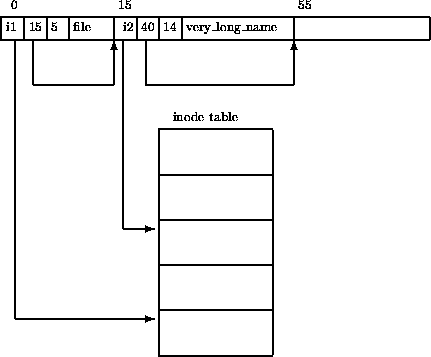

# Sistems de archivos Extended (ext, ext2, ext3, ext4)

## Extended File System (ext)
El Sistema de Archivos Extendido (Extended File System) fue implementado en abril de 1992. Fue el primero de una serie de sistemas de archivos creados exclusivamente para Linux. Fue diseñado por Rémy Card para superar ciertas limitaciones del sistema de archivos de MINIX (el primer sistema de archivos de Linux). Dos de ellas fueron el tamaño máximo de partición y de nombre de archivos. Este sistema permitía 2GB de datos y nombres de archivos de 255 caracteres.

Este sistema fue el primero en utilizar el API del Sistema Virtual de Archivos (VFS).

<figure>
  
  <figcaption>Fig.1 - Estructura del sistema de archivos MiniX.</figcaption>
</figure>

## Second Extended File System (ext2)

Este sistema fue desarrolló en enero de 1993 para el Kernel de Linux 0.99. Surgió como una solución a tres problemas que tenía ext, modificación de inodo, modificación de datos y no soportaba marcas de tiempo (timestamps) para acceso de archivo.

### Estructura en disco

EXT2 está hecho bajo la prmisa que toda la información que exista en los archivos debe ser mantenida en bloques de datos. Estos bloques son todos de la misma longitud y están agrupados en grupos de bloques. Cada grupo contiene una copia del super bloque y su tabla de descriptor de grupo. Todos los bloques contienen un bitmap de bloque, un bitmap de inodos, una tabla de inodos y por último los bloques de datos.

<figure>
  
  <figcaption>Fig.2 - Estructura de un bloque en ext2.</figcaption>
</figure>

#### Superbloque

El superbloque contiene una descripción del tamaño básico y la forma de este sistema de archivos. Normalmente este archivo se lee del Grupo de Bloques 0 cuando el sistema es montado. Cada Bloque de Grupo contiene una copia duplicada en caso de corrupción.

El superbloque contiene, entre otra información, lo siguiente:

- Número Mágico
- Numero de Bloques de Grupo
- Tamaño de bloque
- Bloques por Grupo
- Bloques libres
- Inodos libres
- Primer inodo

#### Descriptor de Grupo

Cada Grupo contiene una estructura de datos que lo describe. Como el superbloque, todos los descriptores de grupos para todos los Grupos de Bloque están duplicados en cada Grupo en caso de corrupción de sistema.

Cada Descriptor de Grupo contiene, entre otra información, lo siguiente:

- Dirección de inicio del Bitmap del Bloque
- Dirección de inicio del Bitmap de Inodo
- Dirección de inicio de Tabla de Inodos

#### Bitmap de bloque

Es una estructura que representa el estado actual de un Bloque dentro de un Grupo de Bloques. Cada bit representa dicho estado, un 1 significa “en uso” y un 0 significa “libre/disponible”.

#### Bitmap de inodos

El Bitmap de inodos funciona de manera similar al Bitmap de Bloque, con la diferencia de que cada bit representa un inodo en la Tabla de Inodos en lugar de un bloque. 

#### Tabla de inodos

La tabla de inodos es usada para mantener registro de cada directorio, archivo regular, enlace simbólico o archivo especial.

#### Inodos

Los inodos son el bloque de construcción básico; cada archivo y directorio en el sistema de archivos es descrito por un y sólo un inodo. El inodo incluye información acerca del tamaño, permiso, dueño y localización en disco de un archivo o directorio. Los inodos no guardan la información del nombre del archivo, esta información se guarda en los directorios.

<figure>
  
  <figcaption>Fig. 3 - Estructura de un inodo en ext2.</figcaption>
</figure>

#### Directorios

Los directorios son archivos especiales que son usados para crear y guardar rutas de acceso a los archivos en el sistema de archivos. Se utilizan para ordenar jerárquicamente archivos. Cada directorio puede contener otros directorios, archivos regulares y archivos especiales.

Cada directorio contiene la siguiente información:

- El inodo de esta entrada de directorio.
- La longitud de esta entrada del directorio en bytes
- El nombre de esta entrada del directorio.

Las primeras dos entradas para cada directorio siempre son el estándar “.” y “..” (“este directorio” y el “directorio padre”, respectivamente).

<figure>
  
  <figcaption>Fig 4. - Estructura de un directorio ext2</figcaption>
</figure>

## Third Extended File System (ext3)

Ext3 es un sistema de archivos con registro por diario (journaled file system). Este sistema se unió al kernel principal de Linux en noviembre de 2001. Fue desarrollado por Stephen Tweedie. Tiene la ventaja de que los usuarios pueden actualizar desde ext2 sin tener que realizar copias de seguridad ni restaurar datos.

El sistema ext3, añade las siguientes características ext2.
- Un registro de diario (journal).
- Estructura de Arbol HTree para indexar grandes directorios.
- Crecimiento en línea del sistema de archivos.

### Journaled File System (JFS)

Los JFSs son sistemas que mantienen registro de los cambios que aún no han sido entregados a la parte principal del sistema de archivos. Consisten un registro de diario en el que se almacena la información necesaria para restablecer los datos afectados por la transacción en caso de que esta falle.

Como los registros en el diario son escritos antes de que los cambios al sistema de archivos estén hechos, y como el sistema de archivos mantiene estos registros hasta que los cambios han sido aplicados al sistema de archivos, los sistemas con registro por diario maximizan la consistencia y minimizan el tiempo de reinicio en caso de un apagado de sistema inapropado.

### Límites en tamaño de ext3

El número máximo de bloques para ext3 es 232. El tamaño del bloque puede variar, afectando máximo de archivos y al tamaño máximo del sistema de archivos.

<table>
    <thead>
        <tr>
            <td>Tamaño del bloque</td>
            <td>Tanmaño máximo de archivo</td>
            <td>Tamaño máximo del sistema de archivos</td>
        </tr>
    </thead>
    <tbody>
        <tr>
            <td>1 KB</td>
            <td>16 GB</td>
            <td>2 TB</td>
        </tr>
        <tr>
            <td>2 KB</td>
            <td>256 GB</td>
            <td>8 TB</td>
        </tr>
        <tr>
            <td>4 KB</td>
            <td>2 TB</td>
            <td>16 TB</td>
        </tr>
    </tbody>
</table>

### Niveles del Journaling
- **Journal**. Los metadatos y los ficheros de contenido son copiados al diario antes de ser llevados al sistema de archivos principal. Es el modo más lento y seguro.
- **Ordered**. Este modo solo registra los cambios en los metadatos del sistema de archivos, pero vacía las actualizaciones de datos de archivos en el disco antes de realizar cambios en los metadatos del sistema de archivos asociado. Es el modo por defecto en ext3.
- **Writeback**. Este modo solo registra los cambios en los metadatos del sistema de archivos. Este modo depende de que el proceso de escritura del sistema de archivos escriba los cambios de datos de archivos en el disco. Es el modo más rápido y riesgoso.

## Fourth Extended File System (ext4)

## Comparación

<table>
    <thead>
        <tr>
            <td></td>
            <td></td>
            <td></td>
            <td></td>
        </tr>
    </thead>
    <tbody>
        <tr>
            <td></td>
            <td></td>
            <td></td>
            <td></td>
        </tr>
        <tr>
            <td></td>
            <td></td>
            <td></td>
            <td></td>
        </tr>
    </tbody>
</table>

## Referencias

[1] Rusling, D. A. (S.F.). The Second Extended File System (EXT2). Recuperado 11 octubre, 2019, de http://www.science.unitn.it/%7efiorella/guidelinux/tlk/node95.html

[2] Poirier, D. (2002). Second Extended File System.

[3] Wikipedia Contributors. (2019B, 20 de septiembre). File System for the Linux Kernel. Recuperado 11 octubre, 2019, de https://en.wikipedia.org/wiki/Ext2

[4] Carrier, B. (2005). File System Forensic Analysis. Boston, USA: Addison-Wesley.

[5] Shangyou Zeng. Linux Journaling File System: EXT3.
