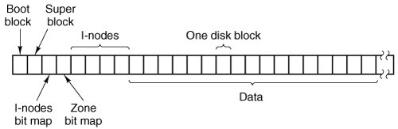
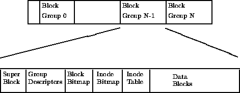

# Sistems de archivos Extended (ext, ext2, ext3, ext4)

## Extended File System (ext)
El Sistema de Archivos Extendido (Extended File System) fue implementado en abril de 1992. Fue el primero de una serie de sistemas de archivos creados exclusivamente para Linux. Fue diseñado por Rémy Card para superar ciertas limitaciones del sistema de archivos de MINIX (el primer sistema de archivos de Linux). Dos de ellas fueron el tamaño máximo de partición y de nombre de archivos. Este sistema permitía 2GB de datos y nombres de archivos de 255 caracteres.

Este sistema fue el primero en utilizar el API del Sistema Virtual de Archivos (VFS).

<figure>
  
  <figcaption>Fig.1 - Estructura del sistema de archivos MiniX.</figcaption>
</figure>

## Second Extended File System (ext2)

Este sistema fue desarrolló en enero de 1993 para el Kernel de Linux 0.99. Surgió como una solución a tres problemas que tenía ext, modificación de inodo, modificación de datos y no soportaba marcas de tiempo (timestamps) para acceso de archivo.

### Estructura en disco

EXT2 está hecho bajo la prmisa que toda la información que exista en los archivos debe ser mantenida en bloques de datos. Estos bloques son todos de la misma longitud y están agrupados en grupos de bloques. Cada grupo contiene una copia del super bloque y su tabla de descriptor de grupo. Todos los bloques contienen un bitmap de bloque, un bitmap de inodos, una tabla de inodos y por último los bloques de datos.

<figure>
  
  <figcaption>Fig.2 - Estructura de un bloque en ext2.</figcaption>
</figure>

#### Superbloque

El superbloque contiene una descripción del tamaño básico y la forma de este sistema de archivos. Normalmente este archivo se lee del Grupo de Bloques 0 cuando el sistema es montado. Cada Bloque de Grupo contiene una copia duplicada en caso de corrupción.

El superbloque contiene, entre otra información, lo siguiente:

- Número Mágico
- Numero de Bloques de Grupo
- Tamaño de bloque
- Bloques por Grupo
- Bloques libres
- Inodos libres
- Primer inodo

#### Descriptor de Grupo

Cada Grupo contiene una estructura de datos que lo describe. Como el superbloque, todos los descriptores de grupos para todos los Grupos de Bloque están duplicados en cada Grupo en caso de corrupción de sistema.

Cada Descriptor de Grupo contiene, entre otra información, lo siguiente:

•	Dirección de inicio del Bitmap del Bloque
•	Dirección de inicio del Bitmap de Inodo
•	Dirección de inicio de Tabla de Inodos

#### Bitmap de bloque

Es una estructura que representa el estado actual de un Bloque dentro de un Grupo de Bloques. Cada bit representa dicho estado, un 1 significa “en uso” y un 0 significa “libre/disponible”.

#### Bitmap de inodos

El Bitmap de inodos funciona de manera similar al Bitmap de Bloque, con la diferencia de que cada bit representa un inodo en la Tabla de Inodos en lugar de un bloque. 

#### Tabla de inodos

La tabla de inodos es usada para mantener registro de cada directorio, archivo regular, enlace simbólico o archivo especial.

#### Inodos

Los inodos son el bloque de construcción básico; cada archivo y directorio en el sistema de archivos es descrito por un y sólo un inodo. El inodo incluye información acerca del tamaño, permiso, dueño y localización en disco de un archivo o directorio. Los inodos no guardan la información del nombre del archivo, esta información se guarda en los directorios.

<figure>
  
  <figcaption>Fig. 3 - Estructura de un inodo en ext2.</figcaption>
</figure>

## Comparación

<table>
    <thead>
        <tr>
            <td></td>
            <td></td>
            <td></td>
            <td></td>
        </tr>
    </thead>
    <tbody>
        <tr>
            <td></td>
            <td></td>
            <td></td>
            <td></td>
        </tr>
        <tr>
            <td></td>
            <td></td>
            <td></td>
            <td></td>
        </tr>
    </tbody>
</table>

## Referencias

[1] RUSLING, D. A. (S.F.). THE SECOND EXTENDED FILE SYSTEM (EXT2). RECUPERADO 11 OCTUBRE, 2019, DE HTTP://WWW.SCIENCE.UNITN.IT/%7EFIORELLA/GUIDELINUX/TLK/NODE95.HTML

[2] POIRIER, D. (2002). SECOND EXTENDED FILE SYSTEM.

[3] WIKIPEDIA CONTRIBUTORS. (2019B, 20 SEPTIEMBRE). FILE SYSTEM FOR THE LINUX KERNEL. RECUPERADO 11 OCTUBRE, 2019, DE HTTPS://EN.WIKIPEDIA.ORG/WIKI/EXT2

[4] CARRIER, B. (2005). FILE SYSTEM FORENSIC ANALYSIS. BOSTON, USA: ADDISON-WESLEY.