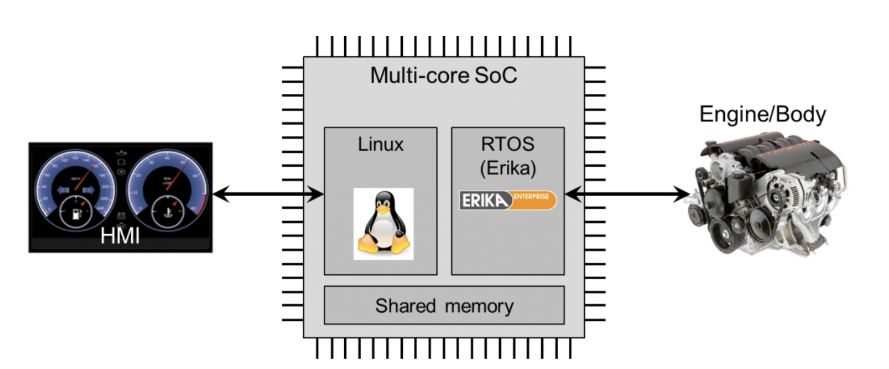

# Vehículos Autónomos

## Introducción

Si hay algo que caracteriza al ser humano, es su insaciable sed de progreso y ambición. La respuesta a la pregunta: *¿Cuándo será suficiente?* parece nunca llegar y es un común denomidador en todas las áreas bajo el dominio del ser humano; desde las artes visuales hasta los movimientos sociales. Evidentemente la ciencia y la tecnología juegan un rol protagónico en esta pregunta, pues son los jugadores más fuertes a la hora de evolucionar y avanzar a la sociedad en una búsqueda existencialista durante su corta historia. Uno de estos claros ejemplos de evolución es la manera en cómo nos transportamos. 

Naturalmente, comenzamos caminado y corriendo hace 5,000 años, después logramos modificar nuestro entorno para que fuesen los caballos quienes nos transportaran en carruajes y posteriormente Ford nos introdujo un *carruaje sin caballos*, posteriormente conocido como coche, en 1893. Hoy en día y en pleno comienzo del siglo XXI, nos encontramos en un punto de inflexión pues estamos dándole la bienvenida a los *coches sin humanos*. 

## Un poco de historia...

* **Stanford Cart**: primer vehículo autónomo construido en 1961, sin embargo, para avanzar un metro tomaba entre 10 y 15 min. 
* **NavLab 5**: investigadores de la universdidad Carnegie Mellon construyeron esta camioneta que podía manejarse por sí sola mientras que los humanos controlaban los frenos y la gasolina. 
* **Boss**: para el tercer y última competencia de la agencia estadounidense DARPA, esta camioneta construida por investigadores de la universidad Carnegie Mellon en conjunción con General Motors lograron ganar la prueba con resultados soprendentes. 
* **Google Prius**: Larry Page, co fundador de Google, le pidió a Sebastian Thrun, uno de los ganadores del Urban Challenge (lanzado por DARPA) que construyera un carro que pudiera manejar 1,600 km por la calles de California. 
* **Tesla y más**: hoy en día tenemos algunas compañías automotrices que presumen de tener coches en el mercado que sean autónomos y vemos que han invertido grandes cantidades de dinero en el área de investigación. Algunos ejemplos son Tesla o General Motors. 

## Sobre ética y otros asuntos...

Previo a pasar a las partes técnicas, hay que considerar que los vehículos autónomos dentro de muy poco tiempo tendran que tomar deciciones éticas por su cuenta. 


Ahora, esto no es tan sencillo como parece pues como lo indica *The Moral Machine Experiment* realizado por investigadores de diversas universidades y publicado en la revista Nature, la ética depende de la región geográfica en la que nos encontremos y citando a Iyad Rahwan, científica de la computación del MIT, *"[...] no hay reglas universales a la hora de establecer una guía ética"* lo que presupone que no podremos escribir un algoritmo universal que sea aplicado a todo el mundo pues dependiendo de la región, la ética cambia: 


## Vehículos autónomos 

Ahora, ¿qué es lo difícil de construir un vehículo autónomo? Si al final de cuentas humanos y animales lo hacen con tanta facilidad...bueno, pues lo difícil recae que a pesar de contar con bastantes sensores, no siempre es sencillo interpretar la información que te está dando el sensor. Es decir, lograr aterrizar la información que te da el sensor hacía un evento u objeto en particular es extremadamente difícil. Aunado a esto y a diferencia de los robots industriales, estos vehículos son sumamente difíciles de construir porque operan en ambientes dinámicos. Con base en lo anterior, determinamos la siguiente premisa: 

```
Todos los vehículos autónomos deben poder navegar efectivamente dentro de un determinado ambiente.
```

Para lograr esto, el vehículo tiene que ser capaz de lo siguiente: 

1. **Reconocer** su ambiente mediante el uso de sensores: 
   * Odómetros, ultrasónicos, infrarojos, lasers, camaras monoculares, binoculares y trinoculares. 
2. **Razonar** la información de los sensores para determinar su posición y la estructura del ambiente en donde se encuentra y poder determinar qué acciones tomar para cumplir su objetivo. 
   * Planear una ruta de un origen a un destino en presencia de obstáculos conocidos y desconocidos. 

Aterrizando las ideas anteriores a conceptos físicos que requieren cada vehículo autónomo nos encontramos con los siguientes: 

+ **Ubicación**: es indispensable contar con software que use información del GPS para poder decir donde se encuentra el vehículo en relación con su ambiente. 
+ **Percepción**: los vehículos usan radares para detectar obstáculos, un sistema de laser para mapear el ambiente en tres dimensiones y camaras para identificar objetos como semáforos, peatones y otros vehículos
+ **Decisones y acciones**: para responder de manera adecuada ante obstáculos y eventos desconocidos, los vehículos se respaldan en algoritmos entrenados con millones de kilómetros en pruebas de manejo. 

### Interpretación de sensores

El problema principal a la hora de interpretar la información de los sensores es hacer la conexión entre la señal de salida del sensore y las propiedades del mundo tridimensional. Lo que se hace con los vehículos autónomos actuales es lograr que primero se identifiquen un conjunto de características in la información medida que puedan corresponder con las características del mundo. El otro enfoque que se le puede dar a este problema es fusionar los sensores, es decir, combinar la salida de múltiples sensores operando sobre el mismo objeto que se quiere caracterizar. 

### Razonamiento

La idea central de este punto es diseñar algoritmos para que los vehículos realicen efectivamente sus tareas a pesar de encontrarse en un ambiente lleno de incertidumbre. Es por esto, o debería resultar natural pensar, que el tipo de programación se vuelve extremadamente difícil si quisieramos usar un paradigmo imperativo de programación. Los programas basados en este paradigma no están pensados para manejar la interacción por lo que se opta por paradigmas orientados a eventos. 

## Relación con los sistemas operativos 

Actualmente, un vehículo autónomo cuenta con múltiples computadoras y aproximadamente 300 billones de líneas de código que lo hacen funcionar casi a la perfección. Es por esta razón que vale la pena hablar sobre el sistema operativo detrás de alguna de estas computadores y éstes es RTOS o Real-Time Operating System que es una arquitectura que permite que los procesos pasen de manera determinística o en un intervalo de tiempo sin atrazos. Esto es de suma importancia pues la latencia puede ser la diferencia entre ejecutar una acción para salvar o no una vida. Recordemos que por tiempo real nos referimos a una garantía en tiempo de respuesta mas no que un sistema por ser de tiempo real sea más rápido.  

Un RTOS realiza las tareas generales de un sistema operativo, como manejar los recursos de hardware de una computadora y el manejo de aplicaciones, pero aunado a esto, está diseñado específicamente para correr aplicaciones con un timing muy preciso y un gran grado de confianza. Para ser considerado un sistema de tiempo real, éste debe tener un tiempo máximo de ejecución para cada proceso. 

Este tipo de sistemas operativos fueron diseñados para dos tipos de aplicaciones: aplicaciones basadas en eventos y aplicaciones de lazo cerrado. En el caso de los vehículos autónomos se emplea para aplicaciones de lazo cerrado pues los sistemas de navegación y posicionamiento constantemente procesan información retroalimentada para ajustar su salida. 

En comparación con los sistemas operativos de propósito general, los sistemas operativos de tiempo real siguen las prioridades del programador de manera más estricta. Es decir, si un proceso de alta prioridad está usando el 100% del procesador, no podrá ser interrumpido por un proceso de menor prioridad. Por ejemplo, código con relación a manejo de eventos exteriores o control del sistema tendrán una prioridad más alta que código que haga referencia a guardar en memoria la información. 



Una de las distribuciones de Linux más usadas en sistemas embebidos es **FreeRTOS**. 

 

## ¿Y la memoria?

Finalmente es indispensable hablar sobre la memoria pues no debería ser difícil notar que se necesita procesar una gran cantidad de datos por segundos considerando los múltiples sensores con los que cuenta un vehículo autónomo. Al procesar tanta información es posible encontrarse con problemas de escritura y lecura, lo que significa que tendremos que usar esquemas de memoria que sean eficientes para manejar lo anterior. 

Uno de estos esquemas es RAID (Redundant Array of Independent Disks) que permite incrementar la rapidez para escribir y leer grandes bloques de memoria y crea redundancia de datos en memoria. Este necesario implementar este esquema para evitar que haya problemas a la hora de leer o escribir. 

Uno de los conceptos básicos de RAID es el copiado de información de un disco a otro y el propósito general de usar RAID es incrementar la confianza a la hora de proteger información crítica- 

## Bibliografía 

Awad, E., Dsouza, S., Kim, R., Schulz, J., Henrich, J., Shariff, A., … Rahwan, I. (2018). The Moral Machine experiment. *Nature*, *563*(59). Retrieved from https://www.nature.com/articles/s41586-018-0637-6

Cox, I. J., & Wilfong, G. T. (1990). *Autonomous Robot Vehicles*. Springer-Verlag.

Davies, A. (2018, December 13). Self-Driving Cars: The Complete Guide. Retrieved October 17, 2019, from https://www.wired.com/story/guide-self-driving-cars/.

Henry Ford's First Car. (n.d.). Retrieved October 18, 2019, from https://www.thehenryford.org/collections-and-research/digital-collections/expert-sets/101113/.

Maxmen, A. (2018). Self-driving car dilemmas reveal that moral choices are not universal. *Nature*. Retrieved from https://www.nature.com/articles/d41586-018-07135-0

National Instruments. (2019, March 5). What is a Real-Time Operating System (RTOS)? Retrieved October 20, 2019, from https://www.ni.com/es-mx/innovations/white-papers/07/what-is-a-real-time-operating-system--rtos--.html.

Rusmana, D. (2018, June 9). What is RAID Technology (Data Storage Virtualization) ? Retrieved October 19, 2019, from https://medium.com/@DalihRusmana/what-is-raid-technology-data-storage-virtualization-8eeb5efae386.

Waldrop, M. (2015). Autonomous vehicles: No drivers required. *Nature*. Retrieved from https://www.nature.com/news/autonomous-vehicles-no-drivers-required-1.16832