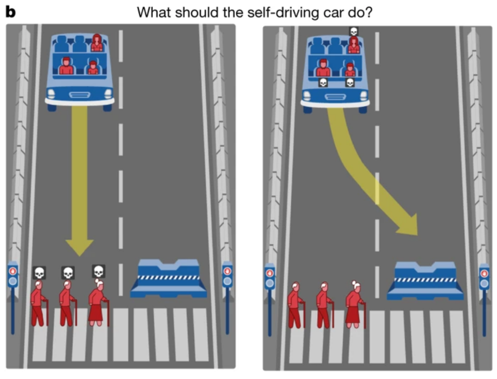
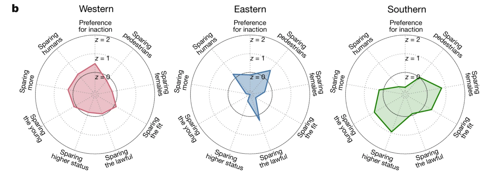
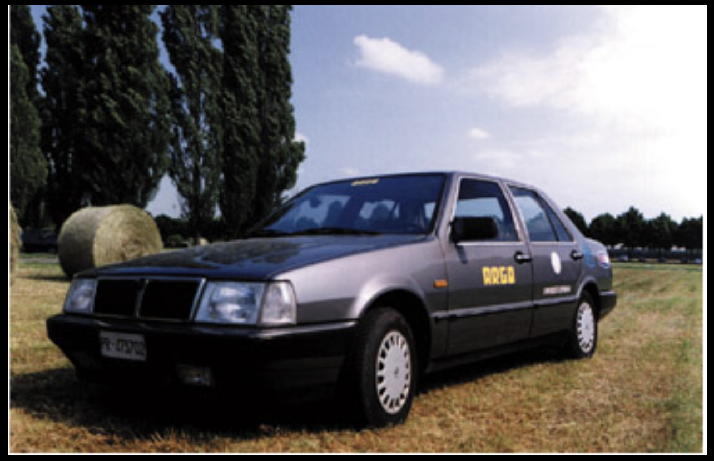
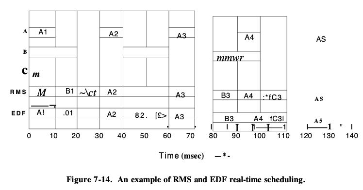

# Vehículos Autónomos

## Introducción

Si hay algo que caracteriza al ser humano, es su insaciable sed de progreso y ambición. La respuesta a la pregunta: *¿Cuándo será suficiente?* parece nunca llegar y es un común denomidador en todas las áreas bajo el dominio del ser humano; desde las artes visuales hasta los movimientos sociales. Evidentemente la ciencia y la tecnología juegan un rol protagónico en esta pregunta, pues son los jugadores más fuertes a la hora de evolucionar y avanzar a la sociedad en una búsqueda existencialista durante su corta historia. Uno de estos claros ejemplos de evolución es la manera en cómo nos transportamos. 

Naturalmente, comenzamos caminado y corriendo hace 5,000 años, después logramos modificar nuestro entorno para que fuesen los caballos quienes nos transportaran en carruajes y posteriormente Ford nos introdujo un *carruaje sin caballos*, posteriormente conocido como coche, en 1893. Hoy en día y en pleno comienzo del siglo XXI, nos encontramos en un punto de inflexión pues estamos dándole la bienvenida a los *coches sin humanos*. 

## Un poco de historia...

* **Stanford Cart**: primer vehículo autónomo construido en 1961, sin embargo, para avanzar un metro tomaba entre 10 y 15 min. 
* **NavLab 5**: investigadores de la universdidad Carnegie Mellon construyeron esta camioneta que podía manejarse por sí sola mientras que los humanos controlaban los frenos y la gasolina. 
* **Boss**: para el tercer y última competencia de la agencia estadounidense DARPA, esta camioneta construida por investigadores de la universidad Carnegie Mellon en conjunción con General Motors lograron ganar la prueba con resultados soprendentes. 
* **Google Prius**: Larry Page, co fundador de Google, le pidió a Sebastian Thrun, uno de los ganadores del Urban Challenge (lanzado por DARPA) que construyera un carro que pudiera manejar 1,600 km por la calles de California. 
* **Tesla y más**: hoy en día tenemos algunas compañías automotrices que presumen de tener coches en el mercado que sean autónomos y vemos que han invertido grandes cantidades de dinero en el área de investigación. Algunos ejemplos son Tesla o General Motors. 

## Sobre ética y otros asuntos...

Previo a pasar a las partes técnicas, hay que considerar que los vehículos autónomos dentro de muy poco tiempo tendran que tomar deciciones éticas por su cuenta. 



Ahora, esto no es tan sencillo como parece pues como lo indica *The Moral Machine Experiment* realizado por investigadores de diversas universidades y publicado en la revista Nature, la ética depende de la región geográfica en la que nos encontremos y citando a Iyad Rahwan, científica de la computación del MIT, *"[...] no hay reglas universales a la hora de establecer una guía ética"* lo que presupone que no podremos escribir un algoritmo universal que sea aplicado a todo el mundo pues dependiendo de la región, la ética cambia: 



## Vehículos autónomos 

Ahora, ¿qué es lo difícil de construir un vehículo autónomo? Si al final de cuentas humanos y animales lo hacen con tanta facilidad...bueno, pues lo difícil recae que a pesar de contar con bastantes sensores, no siempre es sencillo interpretar la información que te está dando el sensor. Es decir, lograr aterrizar la información que te da el sensor hacía un evento u objeto en particular es extremadamente difícil. Aunado a esto y a diferencia de los robots industriales, estos vehículos son sumamente difíciles de construir porque operan en ambientes dinámicos. Con base en lo anterior, determinamos la siguiente premisa: 

```
Todos los vehículos autónomos deben poder navegar efectivamente dentro de un determinado ambiente.
```

Para lograr esto, el vehículo tiene que ser capaz de lo siguiente: 

1. **Reconocer** su ambiente mediante el uso de sensores: 
   * Odómetros, ultrasónicos, infrarojos, lasers, camaras monoculares, binoculares y trinoculares. 
2. **Razonar** la información de los sensores para determinar su posición y la estructura del ambiente en donde se encuentra y poder determinar qué acciones tomar para cumplir su objetivo. 
   * Planear una ruta de un origen a un destino en presencia de obstáculos conocidos y desconocidos. 

Aterrizando las ideas anteriores a conceptos físicos que requieren cada vehículo autónomo nos encontramos con los siguientes: 

+ **Ubicación**: es indispensable contar con software que use información del GPS para poder decir donde se encuentra el vehículo en relación con su ambiente. 
+ **Percepción**: los vehículos usan radares para detectar obstáculos, un sistema de laser para mapear el ambiente en tres dimensiones y camaras para identificar objetos como semáforos, peatones y otros vehículos
+ **Decisones y acciones**: para responder de manera adecuada ante obstáculos y eventos desconocidos, los vehículos se respaldan en algoritmos entrenados con millones de kilómetros en pruebas de manejo. 

### Interpretación de sensores

El problema principal a la hora de interpretar la información de los sensores es deducir las propiedades del mundo tridimensional a partir de las señales de salida de los sensores. Lo que se hace con los vehículos autónomos actuales es lograr que primero se identifiquen un conjunto de características in la información medida que puedan corresponder con las características del mundo. El otro enfoque que se le puede dar a este problema es fusionar los sensores, es decir, combinar la salida de múltiples sensores operando sobre el mismo objeto que se quiere caracterizar. 

### Toma de decisones

La idea central de este punto es diseñar algoritmos para que los vehículos realicen efectivamente sus tareas a pesar de encontrarse en un ambiente lleno de incertidumbre. Es por esto, o debería resultar natural pensar, que el tipo de programación se vuelve extremadamente difícil si quisieramos usar un paradigmo imperativo de programación. Los programas basados en este paradigma no están pensados para manejar la interacción por lo que se opta por paradigmas orientados a eventos. 

## Relación con los sistemas operativos 

### Argo 

Vehículo prototipo desarrollado por la Universidad de Parma en 1998 que manejo por su cuenta 2000 km en carreteras italianas. Toda la información en tiempo real fue procesada por un procesador Pentium MMX (200MHz, 23 MB RAM) en una computadora corriendo Debian 1.2. 

Al finalizar el viaje, el sistema de Argo registró cerca de 1.2 GB de información (velocidad, posiciones del volante, cambios de carril, internvenciones del piloto) y cerca de 1,500,000 imágenes o 330 GB de información. 




### Real-Time Operating Systems 

Actualmente, un vehículo autónomo cuenta con múltiples computadoras y aproximadamente 300 billones de líneas de código que lo hacen funcionar casi a la perfección. Es por esta razón que vale la pena hablar sobre el sistema operativo detrás de alguna de estas computadores y éstes debe ser RTOS o Real-Time Operating System que es un sistema que permite que nos garantiza que uan cierta acción ocurrirá de manera determinística, es decir, en un cierto intervalo de tiempo. Esto es de suma importancia pues la latencia puede ser la diferencia entre tomar una decisión para salvar una vida. Recordemos que por tiempo real nos referimos a una garantía en tiempo de respuesta mas no que un sistema por ser de tiempo real sea más rápido.  

Los RTOS pueden dividirse de acuerdo a dos categorías: 

1. **Basados en eventos**: alternan tareas únicamente cuando un proceso de mayor prioridad necesita atención. 
2. **De tiempo compartido**: alternan tareas basados en las interrupciones de reloj y en eventos. 

Este tipo de sistemas operativos fueron diseñados para dos tipos de aplicaciones: aplicaciones basadas en eventos y aplicaciones de lazo cerrado. En el caso de los vehículos autónomos se emplea para aplicaciones de lazo cerrado pues los sistemas de navegación y posicionamiento constantemente procesan información retroalimentada para ajustar su salida. 

En comparación con los sistemas operativos de propósito general, los sistemas operativos de tiempo real siguen las prioridades del programador de manera más estricta. Es decir, si un proceso de alta prioridad está usando el 100% del procesador, no podrá ser interrumpido por un proceso de menor prioridad. 

```Por ejemplo, código con relación a manejo de eventos exteriores o control del sistema tendrán una prioridad más alta que código que haga referencia a guardar en memoria la información. ```

### Planificación de procesos 

La precisión del sistema no depende únicamente de la respuesta correcta a los eventos externos, sino del tiempo en cuanto estos resultados son producidos. Pensemos que para los vehículos autónomos necesitamos respuestas en un determinado momento y si las tenemos más tarde, a pesar de que sean correctas, éstas no nos servirán. Para la planificación de procesos, la característica más importante es que cada uno de los procesos compitiendo por tiempo de ejecución tienen una determinada prioridad y un tiempo límite de ejecución. 

El comportamiento de tiempo real se logra al dividir el programa en un número de procesos donde el comportamiento de cada uno de ellos es predecible y sabido con anticipación. Cuando un evento externo se detecta, el planificador debe agendar a los procesos de tal manera que todas los **deadlines** se cumplan. Los eventos a los cuales el sistema debe reaccionar pueden ser periódicos o aperiódicos (ocurren sin poder predecirlos). 

Entonces, la cuestión se torna a lo siguiente: supongamos que tenemos tres procesos A,B,C que necesitan ser atendidos y para esto debemos determinar cómo agendarlos para que cada uno se termine de ejecutar en el tiempo límite. Antes de pensar en un algoritmo debemos asegurar que los procesos puedan ser agendados y para esto hay que considerar lo siguiente: 

Dados $$m$$ eventos periódicos (tres procesos), el evento $$i$$ ocurre con periodo $$P_i$$ y requiere $$C_i $$ segundos de ejecución, entonces la carga de trabajo solo podrá ser agendada si y solo si: 
$$
\sum_{i=1}^{m}\frac{C_i}{P_i}\leq 1
$$
Una vez que determinamos que, en efecto, el planificador podrá agendar a los $$m$$ procesos, pasamos a determinar el algoritmo de planificación. Los algoritmos de planificación en tiempo real pueden ser:

1. **Estáticos**: asignan a cada proceso una prioridad con anticipación y después usan *prioritized preemptive scheduling*  usando esas propiedades. 
2. **Dinámicos**: no tienen prioridades fijas. 

Es importante mencionar que los procesos son reemplazables (*preemtable*) lo que significa que a un proceso que esté en riesgo de no cumplir su límite de tiempo se le permite interrumpir a los procesos que estén corriendo para que éste cumpla su límite de tiempo. 

#### Rate Monotonic Scheduling (RMS)

Este algoritmo de planificación puede usarse para procesos que cumplan con las siguientes condiciones: 

1. Cada proceso es periódico y debe completarse dentro de su periodo. 
2. Ningún proceso depende de otro proceso. 
3. Cada proceso necesita el mismo tiempo de CPU 
4. Cualquier proceso aperiódico no tiene límite. 

RMS asigna a cada proceso una prioridad fija dependiendo de la frecuencia de ocurrencia de su evento. Por ejemplo, para un proceso que debe correr cada 30 ms (33 veces por segundo) asigna una prioridad de 33. RMS siempre ejecuta el proceso con prioridad más alta. 

#### Earliest Deadline First Scheduling (EDF)

Este algoritmo es dinámico por lo que permite que sea usado en eventos aperiódicos. Cuando un procesa necesita tiempo de CPU anuncia cuando llegará y el tiempo límite. El planificador guarda una lista de procesos ejecutables ordenados según su tiempo límite. Cuando un proceso anuncia que está listo, el sistema revisa si su tiempo límite ocurre antes de algún proceso que esté actualmente ejecutándose, si es el caso, el nuevo proceso reemplaza al que está corriendo. 

#### RMS vs EDF

Los procesos A,B,C tienen prioridad 33, 25 y 20 respectivamente: 



### Distribuciones

Una de las distribuciones de Linux más usadas en sistemas embebidos es **FreeRTOS**. 

 

## ¿Y la memoria?

Finalmente es indispensable hablar sobre la memoria pues no debería ser difícil notar que se necesita procesar una gran cantidad de datos por segundos considerando los múltiples sensores con los que cuenta un vehículo autónomo. Al procesar tanta información es posible encontrarse con problemas de escritura y lecura, lo que significa que tendremos que usar esquemas de memoria que sean eficientes para manejar lo anterior. 

Uno de estos esquemas es RAID (Redundant Array of Independent Disks) que permite incrementar la rapidez para escribir y leer grandes bloques de memoria y crea redundancia de datos en memoria. Este necesario implementar este esquema para evitar que haya problemas a la hora de leer o escribir. 

Uno de los conceptos básicos de RAID es el copiado de información de un disco a otro y el propósito general de usar RAID es incrementar la confianza a la hora de proteger información crítica. 

## Bibliografía 

Awad, E., Dsouza, S., Kim, R., Schulz, J., Henrich, J., Shariff, A., … Rahwan, I. (2018). The Moral Machine experiment. *Nature*, *563*(59). Retrieved from https://www.nature.com/articles/s41586-018-0637-6

Bertozzi, M. (1999, March 1). Autonomous Vehicles. Retrieved October 22, 2019, from https://www.linuxjournal.com/article/3282.

Cox, I. J., & Wilfong, G. T. (1990). *Autonomous Robot Vehicles*. Springer-Verlag.

Davies, A. (2018, December 13). Self-Driving Cars: The Complete Guide. Retrieved October 17, 2019, from https://www.wired.com/story/guide-self-driving-cars/.

Henry Ford's First Car. (n.d.). Retrieved October 18, 2019, from https://www.thehenryford.org/collections-and-research/digital-collections/expert-sets/101113/.

Maxmen, A. (2018). Self-driving car dilemmas reveal that moral choices are not universal. *Nature*. Retrieved from https://www.nature.com/articles/d41586-018-07135-0

National Instruments. (2019, March 5). What is a Real-Time Operating System (RTOS)? Retrieved October 20, 2019, from https://www.ni.com/es-mx/innovations/white-papers/07/what-is-a-real-time-operating-system--rtos--.html.

Tanenbaum, A. S. (2006). *Modern Operating Systems*. Upper Saddle River: Prentice Hall.

The University of South Wales. (n.d.). Real-time scheduling . Retrieved October 22, 2019, from http://www.cse.unsw.edu.au/~cs3231/05s1/lectures/lect21x6.pdf.

Rusmana, D. (2018, June 9). What is RAID Technology (Data Storage Virtualization) ? Retrieved October 19, 2019, from https://medium.com/@DalihRusmana/what-is-raid-technology-data-storage-virtualization-8eeb5efae386.

Waldrop, M. (2015). Autonomous vehicles: No drivers required. *Nature*. Retrieved from https://www.nature.com/news/autonomous-vehicles-no-drivers-required-1.16832