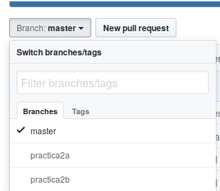

# Práctica 2: Ramas paralelas de desarrollo

    Práctica creada: 2019.08.27
	Entrega en tiempo: 2019.09.03

Como era de esperarse, ya ha ocurrido con varios de ustedes se
confundan al enviar un un *pull request*, incluyendo cambios de más o
de menos, y si no nos cuidamos, pronto enviarán incluso su proyecto de
desarrollo o exposición en distintos estados de desarrollo.

Una de las ventajas que da Git al desarrollo es que nos permite abrir
*ramas temáticas* (en inglés normalmente se les llama *feature
branches*), atendiendo a problemáticas específicas.

Vamos a partir de los siguientes supuestos:

- Un *pull request* debe ir únicamente sobre un problema o sugerencia
  específico.
- Pueden desarrollar dos líneas de pensamiento distintas de forma
  simultánea, pero separada empleando *ramas*
- Una característica fundamental de Git es la preservación de la
  *historia*; si hay algún archivo que subieron al repositorio y le
  dieron `git rm`, sólo se borrará de las versiones nuevas, pero seguirá
  siempre como parte de la historia; (la historia de *commits* se
  mantiene entera.

¿Cómo procedemos entonces?

Supongamos que tienen que entregar, en la misma semana, la práctica
2-A y la práctica 2-B. El contenido de cada una de estas prácticas es
trivial, basta que generen un archivo con su nombre para cada uno de
ellos. El contenido que decidan darle no es muy relevante para esta
práctica.

Les recuerdo, antes de comenzar a desarrollar esta práctica, que como
mencionamos en el [punto 8 de la práctica 1](../1/README.md), deben
*jalar* los últimos cambios que se han realizado en el repositorio
central al de cada uno de ustedes. Esto es:

    $ git pull prof master

En caso de que esto les genere un error, ¡revisen haber cubierto el
punto mencionado!

## ¿Dónde *en la historia del mundo* estoy?

¿Dónde estoy parado? ¿Cómo se ve la realidad? ¿Qué ramas tengo en la
copia local de mi repositorio? El siguiente comando te ayudará a
encontrar la situación actual:

	$ git log --graph --oneline --pretty=format:'%h <%an> %s %Cgreen%d'

En sistemas Unix (posiblemente también en Windows, pero no estoy
seguro), pueden utilizar una interfaz gráfica que les dará información
similar al comando anterior con:

	$ gitk --all

Revisen la salida de este comando en diferentes puntos a lo largo del
ejercicio, prestando particular atención a lo que aparece *en
verde*. Claro, no quiero que se cansen de escribir lo mismo una y otra
vez... Vamos a crear un alias facilito para este comando:

	$ git config alias.lg "log --graph --oneline --pretty=format:'%h <%an> %s %Cgreen%d'"

Con esto, bastará que escriban:

    $ git lg

## Creando dos ramas de desarrollo

Para crear nuestras ramas vamos a usar el comando `git branch`. La
rama sobre la cual trabajamos por omisión se llama `master`. Vamos a
crear una rama llamado `practica2a`, y otra llamada
`practica2b`. Desde el directorio base de nuestro repositorio:

    $ git branch practica2a
	$ git branch practica2b

## Trabajando sobre una de mis nuevas ramas

En este momento, `master`, `practica2a` y `practica2b` apuntan al
mismo *objeto*, al mismo punto en la historia de nuestro proyecto. Y,
a pesar de haber creado las dos ramas, la rama activa sigue siendo
`master`. Vamos a seleccionar, con `checkout`, la práctica 2A, y crear
un archivo dentro de ésta. Por ejemplo, para obtener la fecha del
sistema y guardarla en un archivo:

	$ git checkout practica2a
	$ date > practicas/2/WolfGunnar/A/hora_actual.txt

El comando `git checkout` tiene por efecto que el _punto actual de
trabajo_ en el repositorio sea el que le indicamos; podemos
especificar para el `checkout` el nombre de una rama o el
identificador de un `commit` cualquiera — Volveremos a esto más
adelante.

Como ya sabemos, agrego el archivo y hago mi *commit*:

	$ git add practicas/2/WolfGunnar/A/hora_actual.txt
	$ git commit -m 'Agrego el archivo de Gunnar Wolf para la práctica 2A'

## Vamos con la otra rama...

Ahora, vamos a la rama de la práctica 2B:

	$ git checkout practica2b

Puedes verificar que tu archivo en el directorio de 2A no
existe. ¡No te preocupes, no se ha perdido!

	$ ls practicas/2/WolfGunnar/A/hora_actual.txt
	ls: cannot access practicas/2/WolfGunnar/A/hora_actual.txt: No such file or directory

Ahora, generemos un archivo ejemplo. Puede ser cualquier cosa, en este
caso (desde un sistema Linux) puede ser la información de tu CPU,
según la presenta el sistema operativo (claro, el archivo
`/proc/cpuinfo` sólo existe en Linux; ponle cualquier contenido que
elijas en caso de estar usando otro sistema):

	$ cp /proc/cpuinfo practicas/2/WolfGunnar/B/cpuinfo.txt
	$ git add practicas/2/WolfGunnar/B/cpuinfo.txt
	$ git commit -m 'Agrego el archivo de Gunnar Wolf para la práctica 2B'

## Envía tus cambios mediante *dos* pull requests

Enviamos los cambios a GitHub. Dado que éstos no están en la rama
`master`, hay que indicar expresamente sobre qué rama trabajamos:

	$ git push origin practica2a
	$ git push origin practica2b

Ya con eso, y dado que son dos ideas distintas e independientes,
abrimos *dos pull requests*, uno desde cada una de estas ramas. Para
hacer esto, selecciona cada una de las ramas antes de hacer tu *pull
request*:

¡Recuerda volver a tu rama `master` para seguir trabajando
normalmente!

	$ git checkout master

Posteriormente, puedes incorporar estos cambios a tu rama `master`:

	$ git merge practica2a
	$ git merge practica2b

Podríamos también *no* incorporarlos; en realidad depende de la
naturaleza del proyecto en que estemos trabajando. Para nuestras
prácticas, te sugiero que sí hagas el merge.

Ojo, si estás desarrollando un trabajo mayor (digamos, el proyecto de
unidad o la exposición) y tu rama `master` ha avanzado sensiblemente,
puedes querer sincronizar *al revés*: Sincronizar tu rama con
`master`, para que no crezca demasiado la distancia. Esto es,

	$ git checkout proyecto
	$ git merge master

Claro está, una vez que tu proyecto esté listo para ser entregado,
sincroniza master, envía al servidor:

	$ git checkout master
	$ git merge proyecto
	$ git push

Y no olvides notifícarme por medio de un *pull request*.

## ¿Y qué sigue?

Con los puntos que aquí mencionamos, pueden ya trabajar en más de una
idea al mismo tiempo. ¿Están ya trabajando en el proyecto para la
primera unidad? Bueno, les sugiero que lo hagan en la rama
`proyecto1`. ¿Van a hacer la tarea 3? Háganlo en la rama `tarea3`. De
esta manera, pueden hacerme un *pull request* para cada uno por
separado.

Y, claro, una vez que hagan el *pull request*, hagan avanzar a su rama
principal (`master`) para incorporar a las ramas funcionales. Como
recién lo mencionamos,

	$ git checkout master
	$ git merge proyecto1
	$ git push

¿Qué hay con las ramas ya entregadas? Para el ámbito de nuestro
proyecto, pueden ignorarlas. Sin embargo, no es mala práctica
borrarlas si ya no las van a utilizar. Esto es, si ya incorporé sus
*pull requests*, pueden borrar sus viejas ramas:

	$ git push origin --delete practica2a
	$ git push origin --delete practica2b
