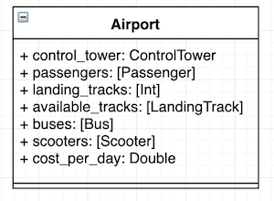
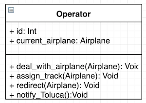
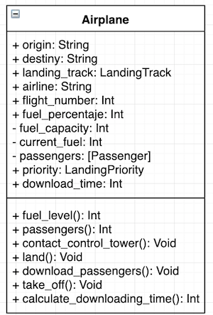
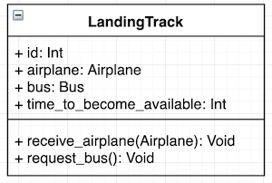
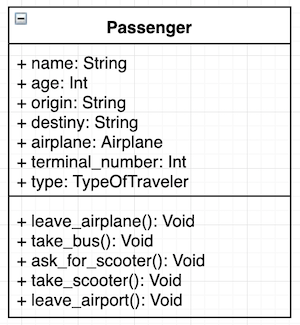
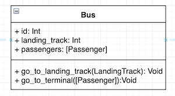
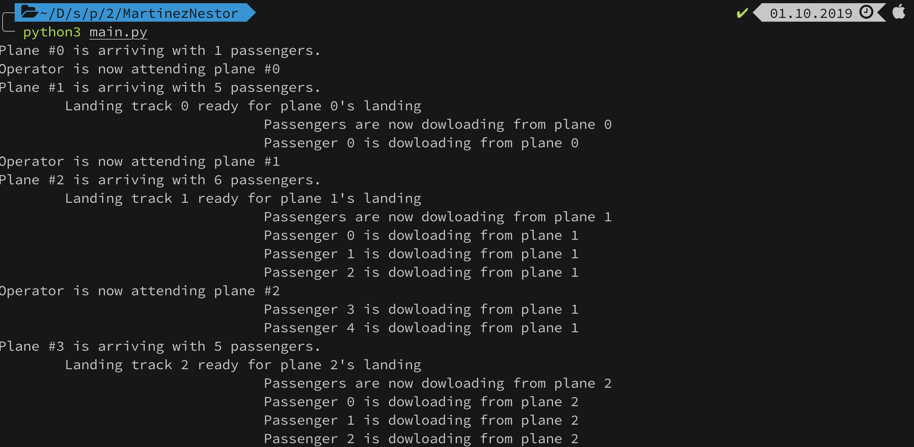
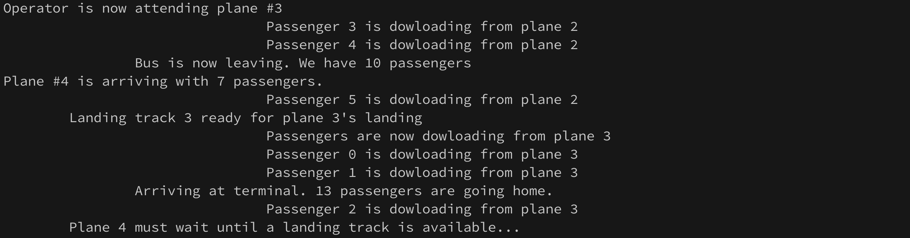

# Aeropuerto Internacional Benito Juárez 

## Integrantes

* Martínez Ostoa Néstor Iván 

## Identificación y descripción del problema

Sobre el aeropuerto Internacional Benito Juárez circulan miles de personas cada día, sin embargo, para asegurar un tránsito exitoso de personas hay mecanismos complejos de sincronización. El gobierno federal  se quiere preparar para una falla de sistemas de comunicación a nivel mundial y saber cuánto le va a costar por día. El objetivo es realizar un sistema de computación que modele la actividad aeroportuaria cada día y calcular el costo por el manejo efectivo de los aviones y pasajeros. Este sistema tiene que modelar dos fenómenos principales: 

	1. El tránsito de aviones coordinados por operadores dentro de la torre de control. 
 	2. El tránsito de pasajeros desde que bajan del avión hasta que llegan a la terminal de salida. 

** **Nota importante**: el aeropuerto solo cuenta con una puerta para cada terminal y el gobierno solo requiere considerar que los aviones que llegan descargan pasajeros y no se llevan pasajeros con ellos. 


Para realizar este sistema de manera exitosa hay que considerar las siguientes reglas: 

* En este aeropuerto, los operadores de la torre de control no saben cuando llegará un avión pues el sistema de comunicaciones con los otros aeropuertos del mundo no funciona. 

* El trabajo de los operadores dentro de la torre de control será asegurarse que cada avión que llegue tenga asegurada una pista de aterrizaje. En caso de que no haya pistas de aterrizaje disponibles:
  * El operador tendrá que mandar al avión a dar otra vuelta, en caso de que el avión tenga un nivel de combustible menor al 25%. 
  * El operador tendrá que mandar al avión al aeropuerto de Toluca, en caso de que el avión tenga un nivel de combustible mayor al 25%. Sin embargo, esta opción penaliza al aeropuerto puesto que tiene que pagar el transporte de los viajeros de Toluca a la Ciudad de México. 

* El aeropuerto cuenta con solo 4 pistas de aterrizaje. 

* Los aviones una vez que aterricen, tendrán tiempo para descargar a los viajeros y posteriormente despegar para liberar la pista. Cada avión tendrá entre 1 y 10 viajeros.

* Una pista de aterrizaje será liberada solo si todos los viajeros han bajado del avión. 

* Una vez que los viajeros bajen del avión, habrá un camión que los llevará a la terminal deseada. El camión solo arrancará si tiene 10 personas dentro de él. Para cada pista de aterrizaje habrá un camión. 

* Los viajeros, en caso de desesperarse, podrán tomar un scooter para llegar a su terminal deseada. 


## Actores dentro del problema 

Estos son los actores (junto con su diagrama de clase) más importantes que juegan un papel fundamental en el desarrollo del sistema : 

1. **Aeropuerto**: el aeropuerto estará encargado de mantener un control del número de pasajeros, número de pistas de aterrizaje, número de camiones, número de scooters y número de aviones dentro de él. 

   

2. **Torre de Control**: su papel fundamental será el de detectar aviones en el aire de la Ciudad de México y asignar éstos a los operadores disponibles. 

   

3. **Operador**: dentro de la torre de control trabajan 3 operadores. Los cuales son encargados de trabajar con los aviones asignados por la torre de control. Cada operador se encarga de asignar una pista de aterrizaje a un avión o redirigirlo si no hay pistas disponibles (en la sección de mecanismo de sincronización se da una descripción de los tipos de redireccionamiento).

   

4. **Avión**: cada avión transporta entre 1-10 pasajeros. Cada avión tiene la responsabilidad de contactar a la torre de control y un operador le dirá qué hacer. Una vez que le es indicado la pista de aterrizaje, el avión calculará el tiempo que tardarán sus pasajeros en salir de él. Este tiempo se lo comunica a la pista de aterrizaje. Una vez que sus pasajeros hayn bajado, el avión tiene que despegar para liberar la pista. 

   

5. **Pista de aterrizaje**: cada pista de aterrizaje recibirá un avión y posteriormente pedirá un camión para transportar a los pasajeros hacía la terminal de salida del aeropuerto. Aunado a lo anterior, cada pista de aterrizaje recibirá un tiempo para estar disponible de nuevo. Este tiempo se lo notifica el avión que va a aterrizar. 

   

6. **Pasajero**: cada pasajero se encuentra inicialmente dentro de un avión. Una vez que el avión aterrizó, estos tienen que bajar de él y tomar un camión que los lleve a la terminal de salida. En caso de estar en la Ciudad de México, tienen la opción de tomar un scooter para llegar a la terminal. 

   

7. **Camión**: cada camión espera en la terminal de camiones hasta que una pista de aterrizaje le notifica que tiene que ir a recoger pasajeros. Sin embargo, una vez que este en la pista de aterrizaje, este camión tiene que esperar a que haya 30 pasajeros dentro de él. 

   

8. **Scooter**: cada scooter espera en la terminal de scooters hasta que un pasajero le notifica que quiere usarlo. Una vez que llega a la pista de aterrizaje correcta, éste lleva al pasajero hasta la terminal de salida. Cada scooter solo puede llevar a un pasajero y su equipaje. 

   


## Mecanismos de sincronización

Al iniciar el programa, la torre de control detecta una cantidad ```n``` de aviones. La torre de control asigna un avión a un operador cuando el operador esté disponible. Cuando el operador decide qué hacer con el avión, éste quita al avión de la lista. Para este punto necesitamos dos mecanismos: 

* Una **señalización** para avisarle a cada operador que hay un avión en la lista. 
* Un **mutex** para proteger el acceso a la lista de aviones detectados pues es compartida entre los diferentes operadores. 

Una vez que un avión es asignado a un operador, el operador se encarga de trabajar con él. Para esto, tiene que consultar una lista global de pistas de aterrizaje disponibles. Si se encuentra una pista disponible, el avión es asignado a ésta y quitado de la lista global de aviones detectados. Para esto necesitamos lo siguiente: 

* Un **mutex** para proteger las operaciones a la lista de pistas de aterrizaje disponibles. 

En caso de que no haya disponibilidad en las pistas, el operador tiene que tomar la decisión de mandar al avión a dar una vuelta o mandarlo al aeropuerto de Toluca. 

* Si elige mandarlo a dar una vuelta, el operador cambia la prioridad del avión a urgente y lo agrega de nuevo a la lista de aviones detectados. Para estas operaciones, necesitamos un **mutex**. 
* Si elige mandarlo a Toluca, el operador tiene que avisarle a un camión en Toluca para que reciba a los pasajeros de ese vuelo y los traiga a la Ciudad de México. Para esto necesitamos una **señalización**. 

Una vez que un avión haya aterrizado en una pista, la pista de aterrizaje detecta esto y avisa al camión que tiene que venir a recoger a los viajeros de ese vuelo. 

* Para esto necesitamos implementar **rendezvous** puesto que el hilo de un camión estará a la espera de que el hilo de la pista tenga un avión y por ende, viajeros que transportar. 

Posteriormente, los pasajeros tienen que bajarse del avión y conforme van bajando, se van agregando a una lista global de pasajeros en tierra. El tiempo de desembarque dependerá de factores como el número de pasajeros y la edad de ellos. La edad pues suponemos que personas de edad mayor o niñ@s tardarán en promedio más tiempo que un adulto. Una vez finalizado el desembarque de pasajeros, el avión despegará y liberará la pista de aterrizaje. 

* Para lo anterior, necesitamos un **mutex** para agregar a los pasajeros a la lista global de pasajeros en tierra y para agregar la pista de aterrizaje a la lista global de pistas de aterrizaje disponibles. 

Una vez que los pasajeros se encuentren en tierra, estos tendrán dos opciones: tomar un camión para llegar a la terminal o tomar un scooter. El camión solo puede arrancar si tiene 30 pasajeros dentro de él, de lo contrario, tendrá que esperar a que lleguen más vuelos. 

* Para lograr lo anterior, necesitamos emplear una **barrera** puesto que el camión tiene que esperar a que lleguen 30 pasajeros para arrancar. 
* También necesitamos un **mutex** para proteger los accesos a una lista de pasajeros en el camión.
* Sin embargo, como el aeropuerto puede manejar 4 camiones (pues es un camión por pista de aterrizaje) necesitamos emplear una lista de semáforos para ir indicando a qué pista se dirigirá un camión.

En caso de que algún pasajero se desespere, puede solicitar un scooter para irse directo a la terminal. 

* Para lograr lo anterior, empleamos una **cola** pues tenemos dos clases de hilos (Viajero y Scooter) y ambos deben proceder en pares. 

* Sin embargo, como el aeropuerto puede manejar 20 scooters, necesitamos emplear una lista de de 20 semáforos inicializados en 0 que se irán liberando conforme los pasajeros los vayan usando. 

Cuando un pasajero llega a la terminal, es necesario actualizar las siguientes listas utilizando un **mutex**:

* Lista de pasajeros en tierra 
* Lista de scooters disponibles 
* Lista de camiones disponibles

## Lógica de operación

* **Estado compartido**:
  * Pistas de aterrizaje disponibles. 
  * Lista de aviones 
  * Aviones que aterrizaron 
  * Pasajeros que bajaron del avión

## Entorno de Desarrollo

* **Lenguaje**:
  * Python 3.7.4
* **Bibliotecas externas**:
  + -- 
* **Sistema operativo**:
  * MacOs 10.14.6

## Para ejecutar el programa

```python3 main.py```

## Screenshots





## Notas

Por cuestiones de tiempo no logré implementar el funcionamiento complejo al que aspiraba y se denota en el documento. Para prueba de ello dejé los archivos dentro de **aicm** y el **main_copy.py** que son implementaciones fallidas del proyecto inicial. Al ver que el tiempo me comía, opté por hacer la solución directa dentro de **main.py**. 