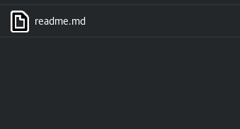

 
# Sistemas operativos
*Ramos Barraza Jorge Luis
Espinoza Ceron Brian Arian*
### Proyecto 2 baños


#### Requerimientos
* python V3  
* linea de comandos
* bibliotecas: `rand` `math` `threading` `time`
#### instrucciones
colocarse en el directorio `proyectos/2/RamosJorge-EspinozaBrian` y ejecutar el siguiente comando

```
python3 proyecto2.py
```
listo deberia verse la ejecucion del programa

> nota: Este problema se implemento en una version 3.5.3 de python en un ordenador con sistema operativo debian 9

#### Problema a resolver


La problemática se centra en un puesto de garnachas, pues un familiar de uno de nosotros labora en un puesto de garnachas, y nos parece interesante el flujo de personas que hay en el transcurso del día. En este negocio se preparan principalmente 3 tipos de alimentos diferentes los cuales son tacos, gorditas y tortas, cada uno de estos alimentos tiene un tiempo de preparacion diferente, mediante el uso de hilos y semaforos nos planteamos simular como es el proceso de servicio a los clientes en un dia normal en el cual acuden un promedio de 100 personas al dia y regularmente son atendidos por 5 personas que laboran en el puesto de garnachas las cuales solamente atienden la orden de una persona a la vez y no atienden a otra hasta que este libre.

#### Mecanismos de sincronización empleados
Hilos  y semaforos


#### Lógica de operación
los hilos son los clientes y los semaforos son las personas que se encargan de despachar a los clientes(hilos) generamos aleatoriamente un numero en el intervalo de 1 a 5 y tambien clasificamos a los hilos en pares e impares, si el numero de hilo es un hilo par nuestra funcion para estimar el tiempo que se va a dormir el hilo va a estar dada por `n=random*2` en cambio si el numero de hilo es impar la funcion sera la siguiente `n=random` Si el número está entre 1 y 3 suponemos que el cliente pidió unos tacos, si el número está entre 3 y 7 suponemos que pidió tortas, finalmente, si el número está entre 7 y 10 suponemos que pidió Gorditas todo esto para darle valores mas reales.

### ejecución




##### interfaz
CLI