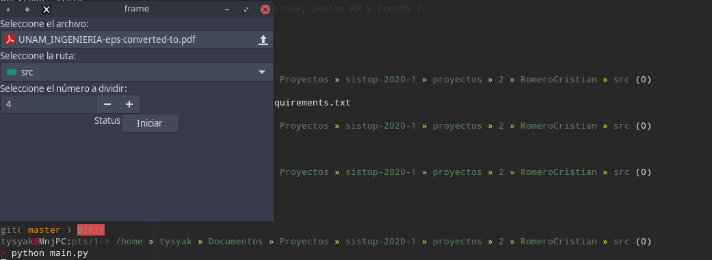
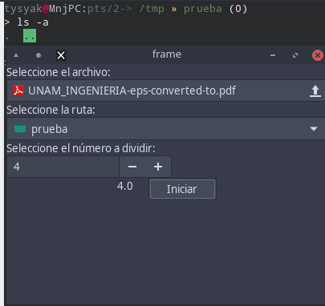
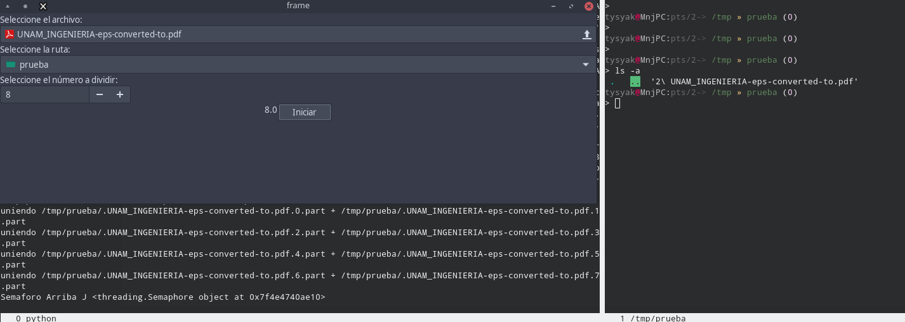
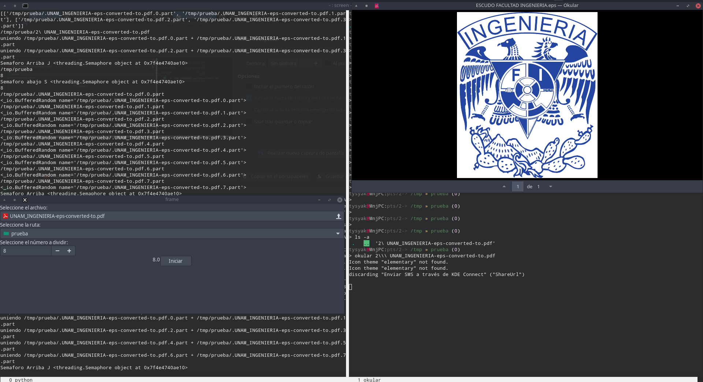

Proyecto 2 - Simulación de envió de archivos (máquina local)
---

## Integrante:
* Romero Andrade Cristian

Introducción
---

Este pequeño programa realiza una simulación de transferencia de archivo de la manera más básica,
donde la maquina se encarga de dividir el archivo en *n* partes, enviarlas a otro lugar.

## Describan la situación que modelarán - Origen de la idea

Aunque sea una simulación, este programa se me ocurrió al tratar enviar un archivo considerablemente
grande, un archivo ISO de CentOS 8 a una USB, donde después de un rato me mandaba el error
de que el archivo es demasiado grande para pasarlo, así que implemente un programa de fácil utilidad
para pasar fragmentos del archivo a la unidad montada para luego unirlos.

## ¿Dónde pueden verse las consecuencias nocivas de la concurrencia? ¿Qué eventos pueden ocurrir que queramos controlar?

A la hora de implementar el programa, hacerlo de manera secuencial era lento, implementar hilos
era la mejor opción, sin embargo tener el estos "hacían lo que querían", por ejemplo,
unían antes de terminar la división o eliminaban las partes antes de terminar la unión, por eso
el uso de un **semáforo** era la mejor opción, donde controlaba que no debían hacer antes.

## ¿Hay eventos concurrentes para los cuales el ordenamiento relativo no resulta importante?

El orden de como se unen los archivos es importante, pero se pude divir entre dos empezando desde el
inicio hasta el final y viceversa. Lo más importante siempre es llegar con la información sin alguna perdida
o corrupción durante el camino.

## Lógica de Operación

* Identificación del estado compartido (variables o estructuras globales)

  * **GUI**
    Todo se trabaja dentro de la gui donde se utilizá un semáforo donde se deja "pasar" el hilo
	consecutivamente del otro.
	
   * **JoinParts**
	 Utiliza el Semaforo proveniente de la **GUI**, esta parte se encarga de unir las partes del archivo.

   * **SplitFile**
	 Utiliza el Semaforo proveniente de la **GUI**, esta parte se va a encargar en separar y escribir el
	 archivo a mover.

## Descripción del entorno de desarrollo, suficiente para reproducir una ejecución exitosa 

### Lenguaje utilizado

Python 3.7.4 - en teoria se utiliza cualquier version desde la 3.*

### Bibliotecas

wxPython==4.0.6

### Plataformas Soportadas

Derivados de Arch Linux, Debian RR y CentOS 7

### Capturas

 
