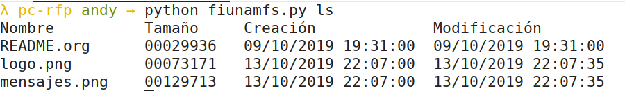
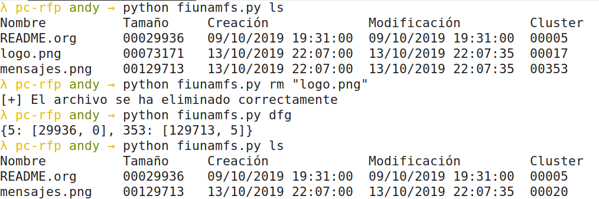
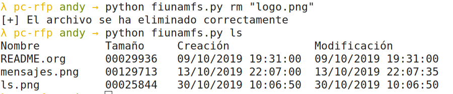
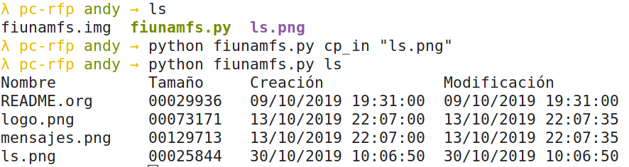
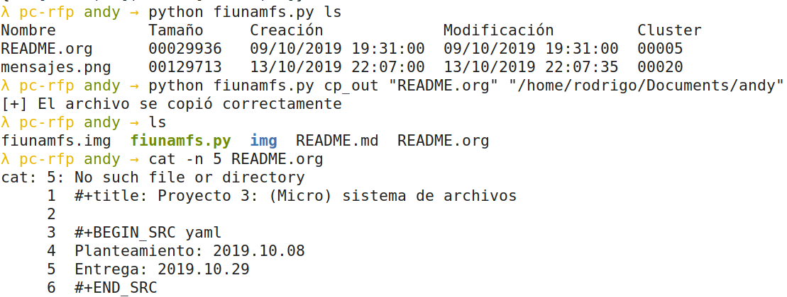

# Microsistema de archivos

## Alumnos

* Flores Martínez Emanuel
* García Ruíz Andrea

## Planteamiento del problema

Desarrollar un programa que pueda obtener,   crear y modificar información en el micro-sistema-de-archivos de la   Facultad de Ingeniería, `FiUnamFS`.

Siguiendo la especificación que aparece en la siguiente sección,   tienen que desarrollar un programa que pueda:

1. Listar los contenidos del directorio
2. Copiar uno de los archivos de dentro del `FiUnamFS` hacia tu sistema
3. Copiar un archivo de tu computadora hacia tu `FiUnamFS`
4. Eliminar un archivo del `FiUnamFS`
5. Desafortunadamente, este sistema de archivos *simplote* es muy dado     a la fragmentación externa. Generen también un programa que     *desfragmente* al `FiUnamFS`. Ojo, la defragmentación debe hacerse     *dentro del sistema de archivos* (no creando un sistema de archivos     nuevo y copiando hacia éste).

## Descripción de la solución

[DESC]

## Entorno y dependencias

Este programa se desarrolló en una sistema operativo tipo *UNIX*  por lo que se recomienda ampliamente utilizarlo en un sistema similar. Está escrito en el lenguaje de programación *Python 3*, en específico la versión *3.5.3*.

Este programa se probó en sistema basado en Debian (Deepin 15.10.1 GNU/Linux).

## Ejecución

Para ejecutar el `FiUnamFS ` se cuenta con tres tipos de comandos distintos

* Los comandos que no necesitan parámetros `ls` y  `dfg`
* Los comandos que cuenta con un parámetro `cp_in` y `rm`
* Y `cp_out` que cuenta con dos parámetros.

#### ls

```bash
python3 fiunamfs.py ls
```



#### dfg

``` bash
python3 fiunamfs.py dfg
```



#### rm

```bash
python3 fiunamfs.py rm
```



#### cp_in

``` bash
python3 fiunamfs.py cp_in <nombre_archivo>
```



#### cp_out

```bash
python3 fiunamfs.py cp_out <nombre_archivo> <ruta>
```



