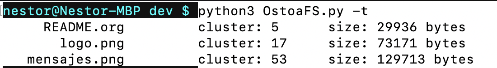

# Proyecto 3

## Integrantes

```
Martínez Ostoa Néstor Iván 
```

## Plan de solución

Aquí podremos encontrar la lista de acciones que tomé para resolver el proyecto: [Plan](https://github.com/nestorivanmo/sistop-2020-1/blob/proyecto3/proyectos/3/MartinezNestor/plan.md). 

## Solución

Dentro del directorio [dev](https://github.com/nestorivanmo/sistop-2020-1/tree/proyecto3/proyectos/3/MartinezNestor/dev) se encuentra el código completo del proyecto junto con capturas de pantalla mostrando el funcionamiento del mismo. 

## Contenidos de FiUnamFS

* README.org 

* logo.png

* mensajes.png

