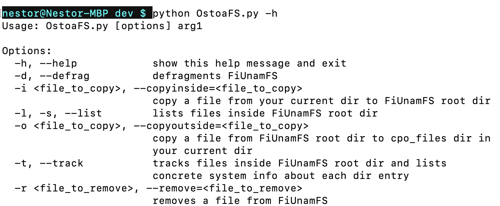
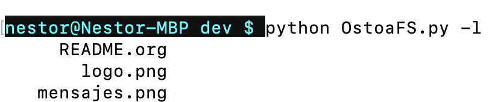
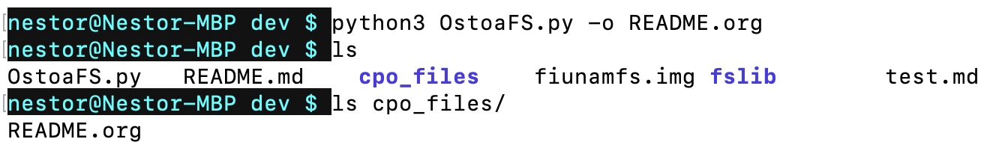
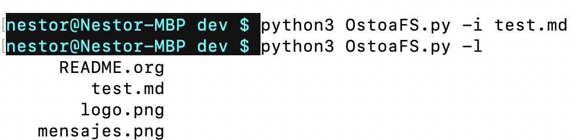
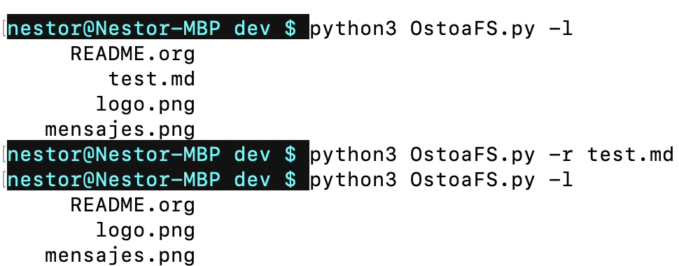
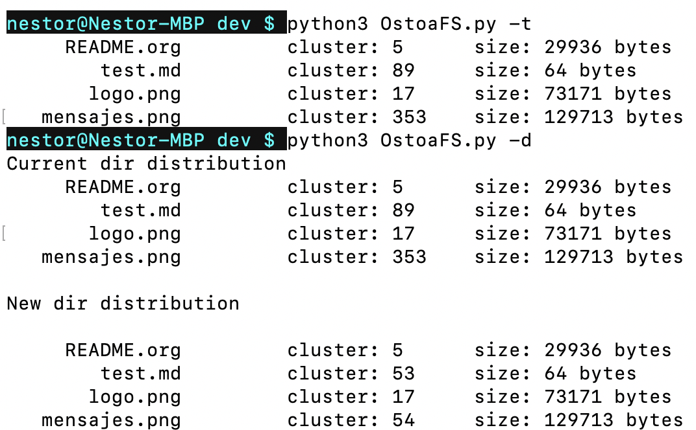
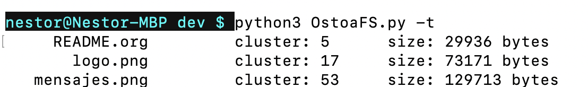

# OstoaFS - Ostoa File System 

## Integrantes 

```
Martínez Ostoa Néstor Iván 
```

## Preámbulo

Para este proyecto cree un programa en ```Python 3.7.4``` que fuera capaz de realizar las siguientes operaciones sobre un micro sistema de archivos llamado ```FiUnamFS```: 

1. Listar el contenido de ```FiUnamFS```. 
2. Copiar uno de los archivos de dentro del `FiUnamFS` hacia ```OstoaFS```. 
3. Copiar un archivo de tu computadora hacia `FiUnamFS`. 
4. Eliminar un archivo del `FiUnamFS`. 
5. Desfragmentar ```FiUnamFS```. 

## Entorno y dependencias 

Entorno: 

* Programa escrito en ```Python 3.7.4``` 

Dependencias externas: 

* Internas de ```Python```: 
  * ```datetime```,  ```mmap``` , ```optparse```, ```os``` , ```random```.

## Desarrollo 

### 0. Ayuda sobre como manjear ```FiUnamFS```:

```python3 OstoaFS.py -h```

```python3 OstoaFS.py --help```



Aquí se pueden observar los comandos disponibles que el usuario puede emplear para manejar el micro sistema de archivos ```FiUnamFS```. 


### 1. Listar 

```python3 OstoaFS.py -l```

```python3 OstoaFS.py --list```



Este comando lista el contenido del directorio raíz de ```FiUnamFS```. 


### 2. Copiar uno de los archivos de ```FiUnamFS``` hacía tu computadora

```python3 OstoaFS.py -o <file_to_copy>```

```python3 OstoaFS.py --outside <file_to_copy>```



Todos los archivos que el usuario quiera copiar desde ```FiUnamFS``` hacía su computadora se guardarán en un directorio llamado ```cpo_files```. 


### 3. Copiar un archivo de tu computadora hacía ```FiUnamFS``` 

```python3 OstoaFS.py -i <file_to_copy>```

```python3 OstoaFS.py --inside <file_to_copy>```



Aquí no hay mayor ciencia, solo copia un archivo de tu directorio al directorio raíz de ```FiUnamFS```.


### 4. Eliminar un archivo de ```FiUnamFS``` 

```python3 OstoaFS.py -r <file_to_remove>```

```python3 OstoaFS.py --remove <file_to_remove>```




### 5. Desfragmentar ```FiUnamFS``` 

```python3 OstoaFS.py -d```

```python3 OstoaFS.py --defrag```




### 6. Track ```FiUnamFS```:

```python3 OstoaFS.py -t```

```python3 OstoaFS.py --track```



Este comando rastrea los archivos dentro del directorio raíz de ```FiUnamFS``` junto con su cluster inicial y el tamaño de la entrada en el directorio raíz. 

