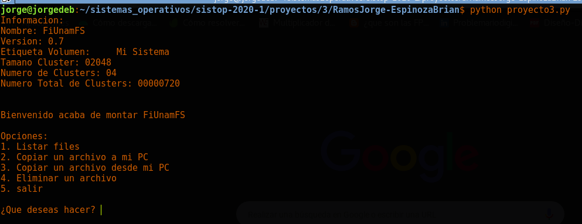
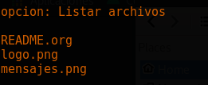
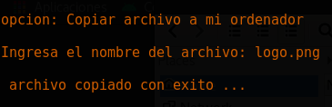
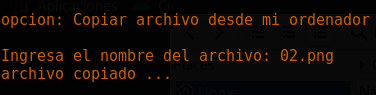
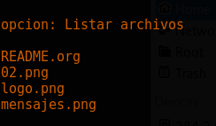
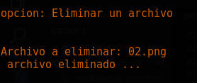

## Proyecto 3 

El proposito de este proyecto es otener, crear y modificar información en el micro-sistema-de-archivos de la Facultad de Ingeniería en su version 0.7 ```FiUnamFS.```

> Interfaz CLI

## Introducción 

El proyecto presenta un programa que permite dado un archivo con extension .img un sistema de archivos muy sencillo bajo las características que se solicitaron y que permite realizar las siguientes operaciones:

* **Montaje**
* **Listado de Archivos**
* **Copiar archivos hacia el FS**
* **Copiar archivos de el FS a mi sistema**
* **Eliminar archivos**
* **Desfragmentar**


## Desarrollo  ️

El programa solo contiene un archivo: ```proyecto3.py``` , el cual contiene la lógica que hace funcionar al sistema de archivos. A Continuación se describe dicha lógica: 

* **_getFiles()_** : Abre y recorre el archivo obtenido de las listas de los nombres, tamaños y clusters e inicializan cada archivo.

* **getInfo()** : Obtiene y guarda la información del sistema para luego mostrarla.

* **copyTo()** : Copia un archivo de mi sistema de archivos a mi pc

* **deleteFile()** : Se encarga de borrar archivos de mi sistema de archivos

* **copyFrom()** :Copia archivos a la ruta donde se encuentra mi programa hacia el sistema de archivos 

* **main()** : función principal donde se llaman todos los metodos anteriores.

* **salida()** : función que sirve para dar un toque especial cuando salimos del programa.

## Requisitos 
* python V3  
* linea de comandos

Para poder compilar este programa, solo necesitamos tener Python2 instalados en nuestro sistema

```
$ sudo apt-get install python2
```
_Compruebe que ya esta instalado_
```
$ python2 --version
```
### Librerias

 bibliotecas: `os` `math` `datetime` `time`


#### Instrucciones
_¿Cómo ejecutarlo? Fácil.._

colocarse en el directorio `proyectos/3/RamosJorge-EspinozaBrian` y ejecutar el siguiente comando

```
python proyecto3.py
```
listo deberia verse la ejecucion del programa

_Aparecera un menú de opciones, donde podrás escoger una opción de loas ya mencionadas que puede realizar el programa ._


> nota: Anteriormente habiamos estado trabajando con la version 3 de python pero tuvimos problemas con el so por lo que decidimos en esta ocasion trabajar cn una version 2 de python

## Ejecutando el programa  ⚙️

_Explica como ejecutar las pruebas automatizadas para este sistema_
####ejecucion del programa

####listar archivos

####Copiar un archivo a mi PC

####Copiar un archivo a mi PC prueba

####Copiar un archivo desde mi PC

####Copiar un archivo desde mi PC prueba

####Eliminar un archivo

####Eliminar un archivo prueba


## Desarrollo 

Sistemas operativos utilizados:

* [_Kali Linux_ 64-Bit versión 2019.3](https://www.kali.org/downloads/) 
* [_Debian_ versión 10 _'Buster'_](https://www.debian.org/distrib/) 


## Repositorio Github 

Se puede obtener mas informacion a cerca del proyecto en el repositoro de [Github.](https://github.com/unamfi/sistop-2020-1/tree/master/proyectos/3)


## Autores 

Este proyecto fué realizado por:

* **Ramos Barraza Jorge Luis** - [Github](https://github.com/jorgeluis098)- [Instagram](https://www.instagram.com/jorge.luis.rb/)-  [Facebook](https://www.instagram.com/jorge.luis.rb/)
* **Espinoza Cerón Brian Arian**  - [Github](https://github.com/brianarian)  -  [Instagram](https://www.instagram.com/brianarian)-  [Facebook](https://www.facebook.com/arianespin0za)


