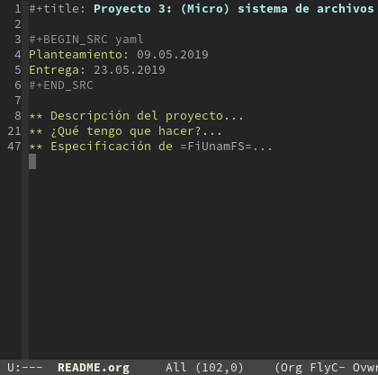
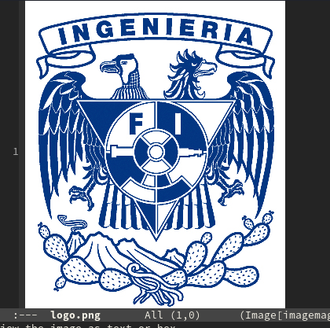
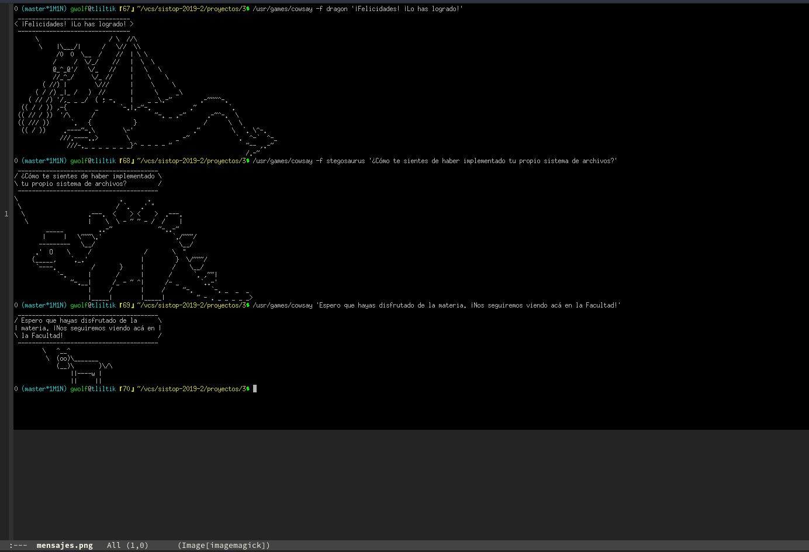
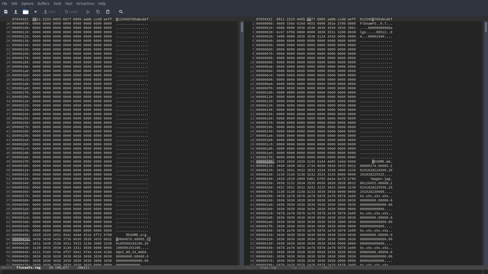
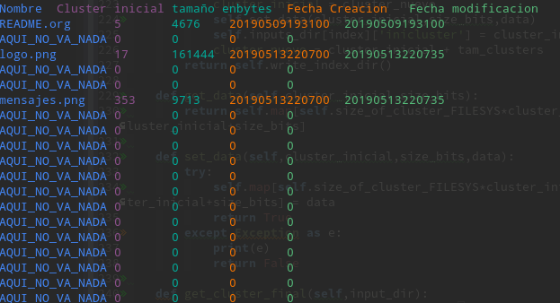
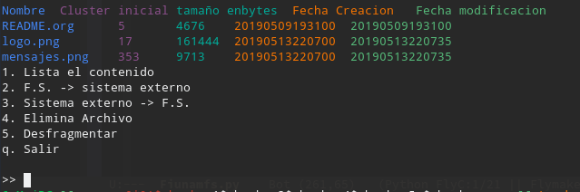
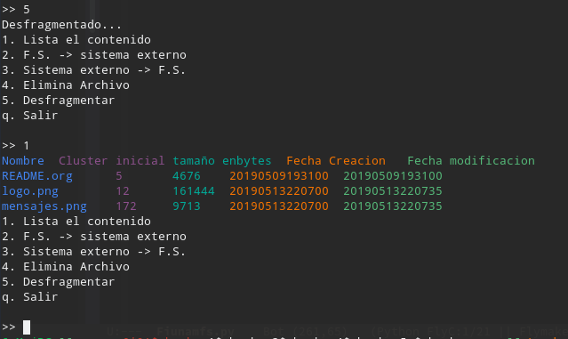

# (Micro) sistema de archivos

## Autor

* Romero Andrade Cristian

## v7.0

# Lenguaje

Python 3

## Uso

Solo ejecutar

```bash
python3 main.py
```

## Funciones

* Lista el contenido
* Del sistema de archivos al sistema externo
* Del sistema externo al sistema de archivos
* Elimina Archivo
* Desfragmentar

## Lo que contenía fiunamfs.img

* README.org



* logo.png



* mensajes.jpg



## Notas:

Para el archivo de prueba que se [nos otorgo](./fiunamfs.img), este estaba para
un sistema acoplado a 1024 en vez del que se nos pidió 512. se nota ya que se empieza
por el 400 hexadecimal en vez del 200 hexadecimal (Claro si es que no estoy ignorando algo).


Aunque aquí si en vez de Xx.xXx.xXx.xXx. de lo pedido es encuentra AQUI_NO_VA_NADA


Pero bueno aplicando unos pequeños cambios para probar la operaciones, aqui va el
ejemplo de la desfragmentación.

Antes


Después



Se anexa [una imagen de prueba generada con los requerimientos](algo.img)
