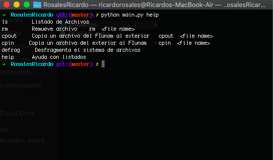
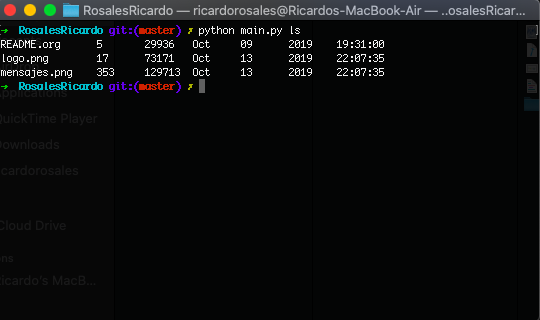
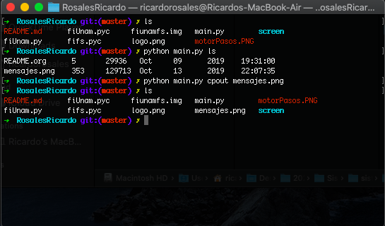
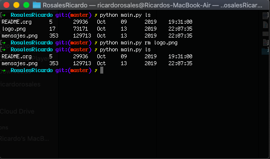

# Proyecto 3 Micro Sistema de Archivos
_En este proyecto se desarrollo un sistema que interpreta la imagen de un sistema de archivos y muestra un listado de los archivos que hay en el, remueve un elemento del archivo, copia un elemento de nuesta computadora al nuestro sistema de archivos y viceversa. Finalmente el programa desfragmenta el sistema de archivos _

## Entorno de desarrollo
1. Lenguaje de programación: **python 3.7.2**
2. Bibliotecas utilizadas: **random, sys , mmap , os, path, math **
3. Desarrollado y probado en: **macOS 10.15** 
**NOTA:** Debería funcionar en entornos UNIX con python 3.7.2 instalado

## Introducción
FiUnam. 

## Desarrollo

Se utilizo la librería de tkinder para desarrollar una interfaz más amigable con el usuario , además de un registro con ususario y contraseña , hasta el momento solo es permitido un usuario porque el método de almacenamiento de usuarios al ser modificado se sobre escribe.

Lo que de verdad interesa es la forma en la cual trabaja con los semaforos para impedir que dos o más aviones se encuentren en la pista final de despegue, permitiendo el acceso a pista secundaria a tres aviones y finalmente limitando la final apra única y exclisivamente un avión. 

### Pruebas de ejecución 

El proyecto fue desarrollado en Python 3.7.0:

-Nos movemos a la carpeta donde se encuentra el archivo **fsm.py**, es decir:

sistop-2020-1/proyectos/3/RosalesRicardo/

Ya dentro del directorio tecleamos lo siguiente:

`$python main.py help`

Opción help : listado de posibles directivas que se le pueden pasar al programa para que realice lo que el usuario desea, además que viene con una breve explicación de la sintaxis.

`$python main.py ls`

Opción ls : nos va a listar el contenido del sistema FiUnamFS y sus metadatos correspondientes.

`$python main.py cpin <nombre_archivo_externo>`

Opción cpin: Copia un archivo que tengamos en nuestra compuradora a nuestro sistem FiUnamFS, en este caso tenemos una imagen llamada : 'img1.png'

`$python main.py cpout <nombre_archivo_interno>`

Opción cpout: Copia un archivo que tengamos en el sistema a la carpeta donde se encuentra este (nuestra computadora)

`$python main.py defrag`

Opción defrag : desfragmenta el sistema de archivos

`$python main.py rm`

Opción rm: Remueve el archivo indicado de nuestro sistema FIUnamFS

Comprobamos que ya no se encuentre el archivo

### Nota 

Este proyecto fue basado en la reutilización de código del proyecto de los compañeros 
Francisco Rodrigo y Sanchez Beatriz

El link se encuentra en [Proyecto Microsistemas de archivos] (https://github.com/gwolf/sistop-2019-2/tree/master/proyectos/3/FranciscoRodrigo-SanchezBeatriz)

Estoy deacuerdo que ese no es el objetivo primario del proyecto , simplemente mejore el código de ingreso de las directivas en terminal y modifique el tamaño de los cluster para que leyera de forma adecuada los inodos correspondientes a la dirección donde se encontraban cada uno de los archivos. Además corregi errores de sintaxis que me marcaban al paso del proyecto. Cabe resaltar que fue un muy buen código el que implementaron para la lectura del sistema quize modificarles algunas cosas más me parecio correcto como lo que implementaron.
