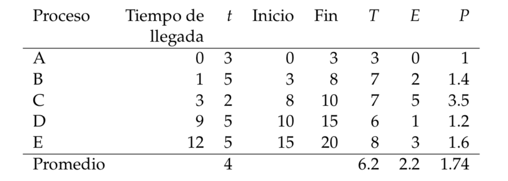
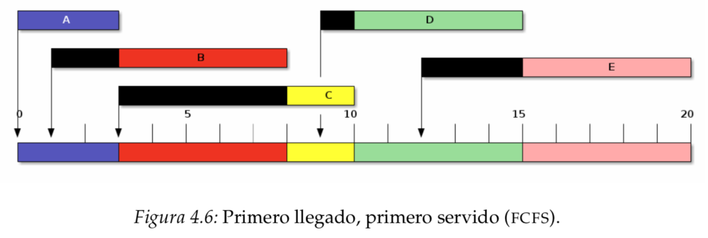
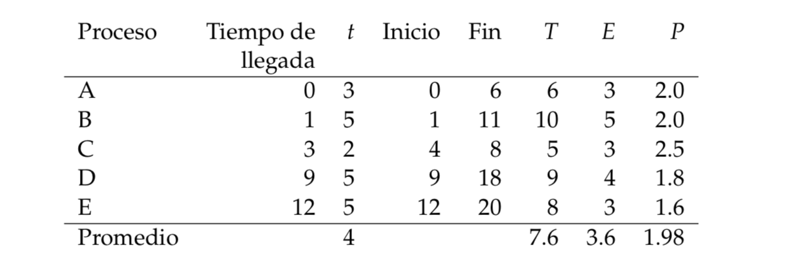
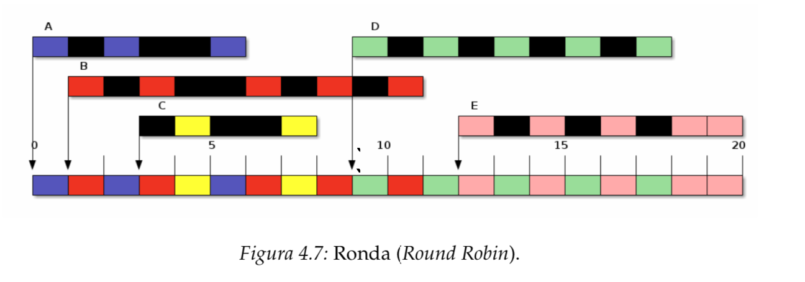
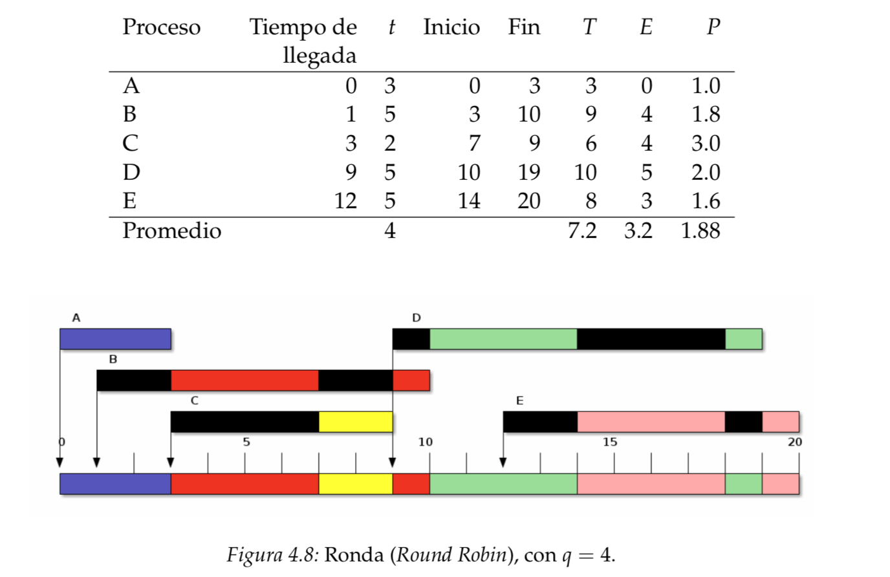
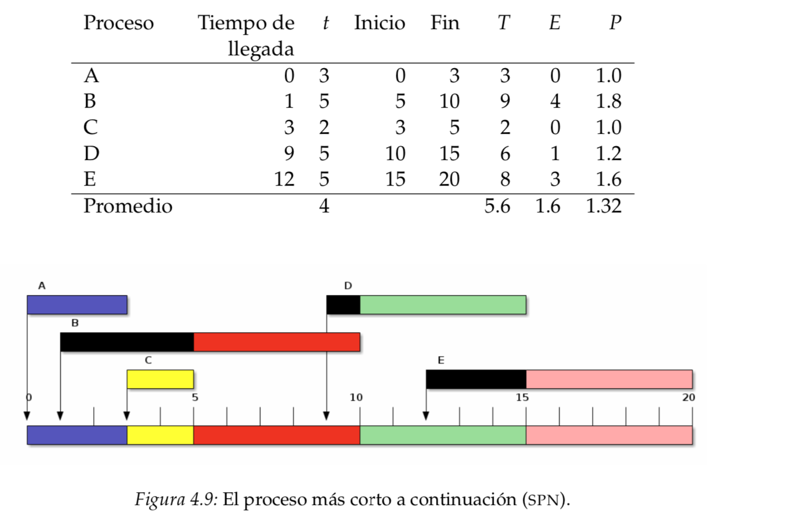
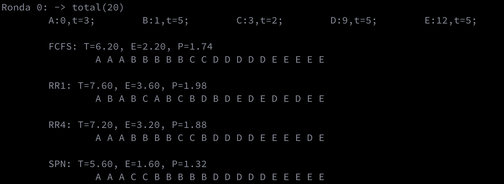

## Tarea 2: Algoritmos de planificación 

El objetivo de esta tarea fue programar los siguientes algoritmos de planificación: 

1. **First Come First Serve**:

   

   

2. **Round Robin**:

   1. Quantum = 1

      

      

   2. Quantum = 4

      

3. **Shortest Process Next**:

   

---

### Resultados

La salida para la configuración de tablas en las imágenes anteriores es la siguiente: 



---

### Para ejecutar 

1. Abre una terminal
2. Asegúrate de tener instalado **Python 3**
3. Ejecuta **main.py** :
4. Por defecto, la ronda 0 es la que se muestra en la tablas y solo hay dos rondas con datos aleatorios. Si quieres agregar más rondas basta con que modifiques, dentro de **main.py** , la variable ```num_rounds```. 


