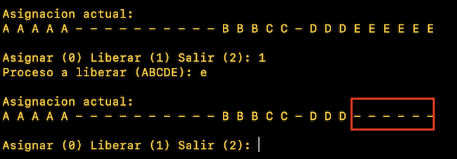
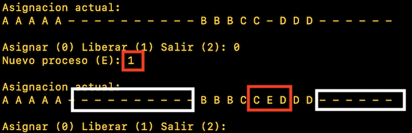
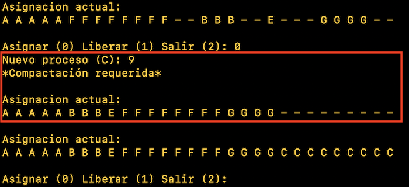
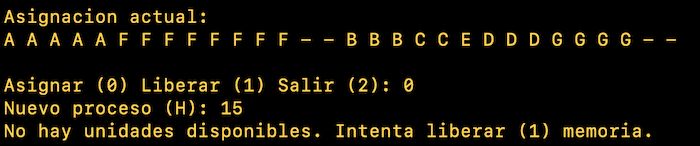

# Tarea 3: Asignación de memoria

## Integrantes

```
Martínez Ostoa Néstor Iván
```

## Entorno y dependencias

* Lenguaje: ```Python 3.7.4```
* Dependencias:
  * ```os```,  ```sys``` , ```random```.

## Desarrollo

** El código de la tarea se encuentra en el archivo ```memory.py```

Estrategia de asignación de memoria: ```Mejor Ajuste```.

```python
def __bestfit__(self, proc):
		"""
			Best fit strategy to assign a process to the memory map.
		"""
		self.procs.append(proc)
		self.units_available -= proc.units
		spaces = self.__findspaces__()
		startindex = None
		lessdiff = self.units + 1
		for key in spaces:
			diff = spaces[key] - proc.units
			if diff == 0:
				startindex = key
				break
			else:
				if diff > 0 and diff < lessdiff:
					lessdiff = diff
					startindex = key
		i = 0
		while i < proc.units:
			self.memorymap[startindex + i] = proc.letter_id
			i += 1
```

## Funcionamiento

### Liberación de memoria 



### Asignación de memoria

#### Sin compactación



Se puede ver que al usar ```MejorAjuste``` como estrategia de asignación, el algoritmo escogerá el lugar que mejor se ajuste al espacio solicitado. En este caso, escoge poner al proceso E en el único espacio disponible. 

#### Con compactación



### Solicitud errónea




