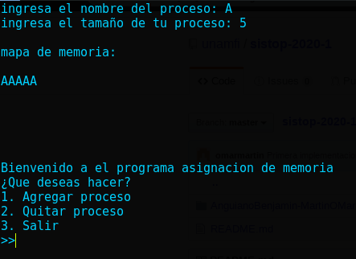
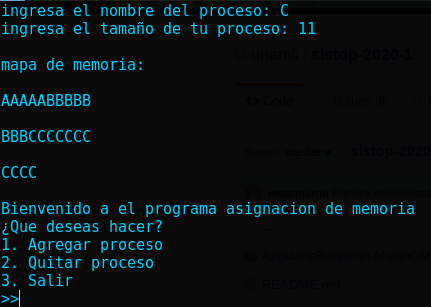

# Tarea 3 Sistop 2019-2

_El proposito de esta tarea es, escribir un programa que implemente los modelos de partición variable y segmentación requieren que el sistema operativo asigne y libere porciones de la memoria conforme lo requiere el conjunto de procesos._

> Interfaz CLI

## Introducción 

_La tarea presenta un programa que  realiza dicha asignación de memoria. Asume un sistema que tiene 30 unidades de memoria (o, mejor aún, que sea parametrizable); un proceso puede especificar que requiere entre 2 y 15 unidades.
Presenta las opciones principales que son_:

* **_1. Agregar proceso_**
* **_2. Quitar proceso_**
* **_3. Salir_**

### Desarrollo 🛠 

_El programa solo contiene un archivo: ```tarea3.py``` , el cual contiene la lógica que hace funcionar al sistema de archivos. A Continuación se describe dicha lógica:_ 

* **initMemory** : La función 'initMemory' inicializa la memoria pidiendo como entrada el nombre del proceso a iniciar y el tamaño de este el cual debe ser entre 2 y 15 verificando asi mismo que haya espacio disponible para poder agregar todavia metodos.

* **deleteMemory** : La función 'deleteMemory' no hace mas que eliminar del arreglo memory los procesos que se le indiquen

* **compactacion** : La función 'carry' realiza la compactacion de la memoria


* **salida** : función para imprimir la salida del programa._

* **main** : función principal que ejecuta un pequeño menu para mandar a llamar a las demas funciones ._


### Requisitos 
* python V3  
* linea de comandos

### Librerias

 bibliotecas: `os` `time`


### Instrucciones
_¿Cómo ejecutarlo? Fácil.._

colocarse en el directorio `tareas/3/RamosJorge-EspinozaBrian` y ejecutar el siguiente comando

```
python3 tarea3.py
```
listo deberia verse la ejecucion del programa

_Aparecera un menú de opciones, donde podrás escoger una opción de las ya mencionadas que puede realizar el programa ._


### Ejecutando el programa  ⚙️

_Explica como ejecutar las pruebas automatizadas para este sistema_
####ejecucion del programa agregando procesos

####ejecucion del programa agregando mas procesos

####ejecucion del programa eliminando procesos

####ejecucion del programa eliminando y agregando procesos


### Entorno de Desarrollo

Sistemas operativos utilizados:

* [_Kali Linux_ 64-Bit versión 2019.3](https://www.kali.org/downloads/) 
* [_Debian_ versión 10 _'Buster'_](https://www.debian.org/distrib/) 


### Repositorio Github 

Se puede obtener mas informacion a cerca del proyecto en el repositoro de [Github.](https://github.com/unamfi/sistop-2020-1/tree/master/tareas/3)


### Desarrolladores 

Este proyecto fué realizado por:

* **Ramos Barraza Jorge Luis** - [Github](https://github.com/jorgeluis098)- [Instagram](https://www.instagram.com/jorge.luis.rb/)-  [Facebook](https://www.instagram.com/jorge.luis.rb/)
* **Espinoza Cerón Brian Arian**  - [Github](https://github.com/brianarian)  -  [Instagram](https://www.instagram.com/brianarian)-  [Facebook](https://www.facebook.com/arianespin0za)


